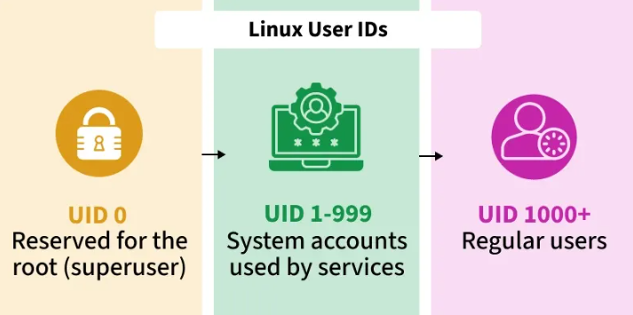
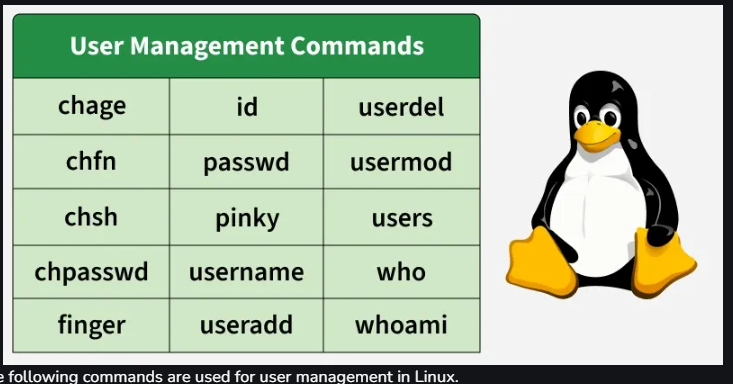

# Day 14 – User Management and Access Control in Linux

## Objective

Today’s focus was on **user management and access control in Linux**, one of the most important parts of system administration.

Linux is built as a **multi-user operating system**, which means different people, services, and applications can use the same machine at the same time without interfering with one another.

The objective for today was to understand how Linux:

* identifies users uniquely
* controls what each user can access
* organizes users into groups
* applies permissions through those groups
* manages password and account security
* tracks logged-in sessions
* safely removes inactive accounts

This is a critical skill for working with:

* Linux servers
* cloud machines
* Docker hosts
* shared data platforms
* production environments

because system security starts with **who can do what**.

---

## What I Learned

## 1) Linux User Types



The first major concept was understanding the different kinds of users Linux supports.

Linux separates users by responsibility and privilege level.

### Root User

The root user is the **superuser account** with unrestricted control.

This account can:

* install packages
* change system files
* create or remove users
* manage services
* delete critical files

It is powerful, which is why it must be used carefully.

### Regular User

This is the standard everyday account used for:

* creating files
* running applications
* navigating directories
* writing scripts

but without direct access to sensitive system settings.

### Sudo User

A sudo user is still a regular user, but can temporarily perform administrative tasks using `sudo`.

This is safer than logging in directly as root.

### Service Accounts

These are accounts created for applications and services like:

* MySQL
* Nginx
* Docker
* system processes

They are intentionally restricted for security.

### Guest Users

Temporary users with minimal access and usually no persistent changes.

This foundation made it easier to understand why Linux user management is really a **security model**.

---

## 2) Understanding UID, GID, and Group Membership

Every Linux user is represented internally with a **UID (User ID)** and **GID (Group ID)**.

I used:

```bash
id
```

Output:

```bash
uid=1000(judoski) gid=1000(judoski) groups=1000(judoski),4(adm),24(cdrom),27(sudo),30(dip),46(plugdev),100(users),1001(docker)
```

This single command explained a lot:

* `uid=1000` → my personal Linux identity
* `gid=1000` → my primary group
* `docker`, `sudo`, `adm` → secondary groups with additional privileges

This is where Linux permissions started making more sense.

Instead of permissions being assigned one user at a time, **groups make permission management scalable**.

---

## 3) Primary vs Secondary Groups

I learned that every Linux user must have:

* **one primary group**
* **zero or more secondary groups**

### Primary Group

This controls the default group ownership of files I create.

For example, when I create a new script or folder, it automatically belongs to my primary group.

### Secondary Groups

These extend access.

A practical example from today was Docker access:

```bash
sudo usermod -aG docker judoski
groups judoski
```

Output:

```bash
judoski : judoski adm cdrom sudo dip plugdev users docker
```

This means my account can now manage containers without typing `sudo` every time.

That is a real workflow improvement.

---

## 4) Important Linux User Management Files


<br><br>

Today also helped me connect user commands to the actual files Linux updates behind the scenes.

### Core user files

* `/etc/passwd` → basic user account details
* `/etc/shadow` → encrypted passwords and expiry settings
* `/etc/group` → group definitions
* `/etc/gshadow` → secure group details
* `/etc/sudoers` → sudo access rules
* `/etc/skel/` → starter files copied into new user home folders
* `/var/log/auth.log` → login and sudo activity logs

This was one of the biggest mindset shifts:

> Linux user commands are really safe ways of editing these system records.

That connection made everything more practical.

---

## 5) Commands Practiced Today



### whoami

Used to confirm the currently active user.

```bash
whoami
```

This is useful when:

* switching users
* using sudo
* debugging scripts
* confirming server identity

---

### id

One of the most useful commands today.

I practiced:

```bash
id -u judoski
id -g
id -G judoski
id -nG judoski
```

This helped me inspect:

* exact UID
* primary GID
* all secondary groups
* readable group names

Very useful for permission troubleshooting.

---

### useradd

This was one of the most practical commands.

I created:

* custom home directories
* fixed UID users
* temporary contractor accounts
* users attached to existing groups

Example:

```bash
sudo useradd -d /home/zenith_project -m zenith_user
sudo useradd -u 1600 -m data_engine
sudo useradd -e 2026-12-31 -m contractor_user
```

What stood out most was **account expiry**.

That mirrors real company workflows where contractors or temporary analysts should automatically lose access after a project ends.

---

### passwd

Today I learned password control goes beyond simply resetting passwords.

Examples:

```bash
sudo passwd user1
sudo passwd -x 30 user3
```

This allowed me to:

* reset user passwords
* force password rotation
* define password lifespan
* strengthen account security

This is critical in team environments.

---

### usermod

This command made user updates much easier.

I practiced:

```bash
sudo usermod -m -d /home/data_engine_workspace data_engine
sudo usermod -g zenith_user data_engine
sudo usermod -L test_user
sudo usermod -U test_user
```

This covers:

* moving home directories
* changing groups
* locking suspicious users
* restoring locked accounts

This feels very real-world.

---

### chage

This command focused on **password aging and expiration policy**.

```bash
sudo chage -l root
```

This shows:

* last password update
* password expiry
* warning days
* inactive lock period

This is excellent for security enforcement.

---

### userdel

Used for safe user cleanup.

```bash
sudo userdel test_user
sudo userdel -r test_user
```

This taught me the importance of removing:

* old interns
* inactive contractors
* unused service accounts
* test users

to reduce attack surfaces.

---

### who, users, and chsh

These commands helped with session visibility and shell control.

```bash
who
users
chsh -s /bin/bash
```

Useful for:

* checking active users
* seeing login sessions
* identifying terminal access
* changing default shells

---

## What I Built / Practiced

Today felt like a **real admin lab**.

I practically worked on:

* inspecting my Linux identity
* verifying Docker group membership
* creating users with fixed UID
* creating project-specific home directories
* assigning primary groups
* changing user workspaces
* locking and unlocking accounts
* testing account expiry workflows
* checking active sessions
* removing test accounts safely

This felt closer to **real production Linux operations** than previous days.

---

## Challenges Faced

The biggest challenge today was **mapping each command to its real-world use case**.

For example:

* when to use `useradd` vs `usermod`
* when password expiry is better than deleting users
* difference between `id` and `groups`
* when to lock vs fully delete an account

Another challenge was remembering that most user commands are actually modifying sensitive files like:

* `/etc/passwd`
* `/etc/shadow`
* `/etc/group`

which means mistakes can directly affect access control.

That made me much more intentional while practicing.

---

## Key Takeaways

The biggest lesson from Day 14 is this:

> Linux user management is the foundation of system security.

A few important things now feel much clearer:

* every user has a unique system identity
* groups make permissions easier to manage
* temporary access should always expire
* inactive users should be cleaned up
* password aging improves security
* session visibility helps monitoring
* shell control improves environment consistency

This is highly relevant for:

* Linux administration
* DevOps
* cloud engineering
* platform engineering
* data engineering

because access mistakes can become security incidents.

---

## Resources

Main learning areas covered today:

* Data Engineering community
* geeksforgeeks

---

## Output

By the end of Day 14, I can now confidently:

* inspect user identity and permissions
* create structured user accounts
* manage groups and Docker access
* enforce password policies
* lock risky accounts
* expire temporary users automatically
* monitor logged-in users
* delete unused users safely
* control default login shells

This was one of the most practical Linux days so far because it connects directly to **security, access control, and production server hygien**.

A strong step forward in thinking more like a **Linux administrator and data engineer working on shared systems**.


