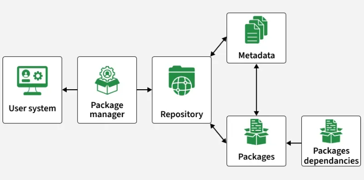
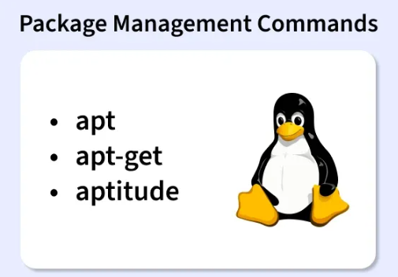
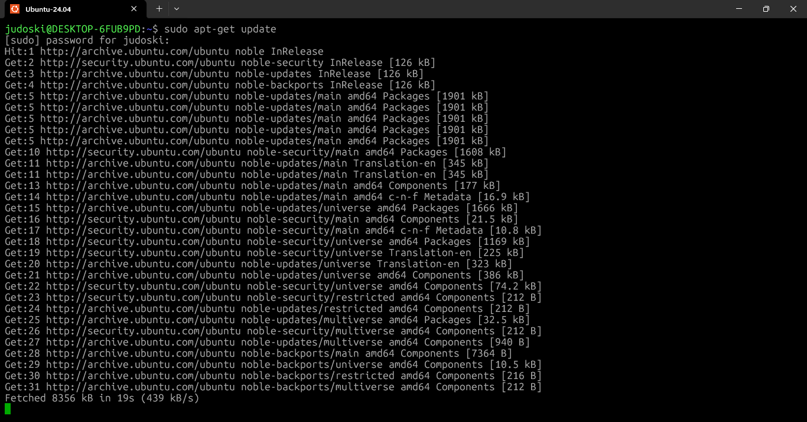
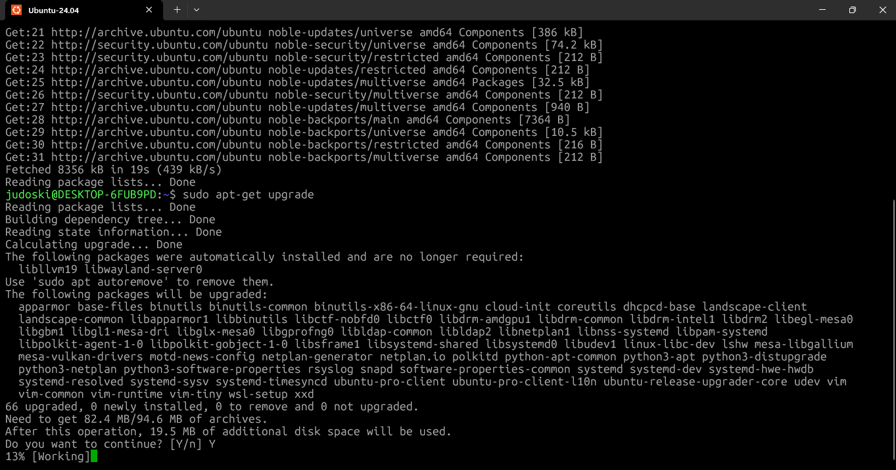

# **Day 16 – Package Managers, systemctl & Package Commands in Linux**

## **Objective**

Today’s focus was on understanding how Linux manages software and services using package managers and system control tools.

Linux systems don’t rely on manual software installation like other operating systems. Instead, they use package managers to install, update, and remove software efficiently while handling dependencies automatically.

The goal was to understand how Linux:

* installs and manages software packages
* handles dependencies automatically
* updates and maintains system stability
* removes software cleanly
* controls system services using `systemctl`

This is critical when working with:

* Linux servers
* cloud environments
* DevOps workflows
* production systems

Because managing software and services properly is what keeps systems stable, secure, and reliable.

---

## **What I Learned**

### **1) What a Package Manager Does**

A package manager acts as the central system for managing software in Linux.

Key functions include:

* **Installation:** installs software along with dependencies
* **Dependency Resolution:** automatically fetches required libraries
* **Upgrading:** updates software to newer versions
* **Removal:** safely uninstalls packages
* **Querying:** provides package details and system info

---

### **2) Package Manager Architecture**




A package manager doesn’t work alone—it interacts with multiple components:

| Component       | Description                                      |
| --------------- | ------------------------------------------------ |
| User System     | Where commands like `apt install` are executed   |
| Package Manager | Processes commands and manages operations        |
| Repository      | Stores packages and metadata                     |
| Metadata        | Contains package details (version, dependencies) |
| Packages        | Actual software files                            |
| Dependencies    | Required supporting packages                     |

---

### **3) Common Linux Package Managers**

Different Linux distributions use different package managers:

#### **APT (Debian/Ubuntu)**

* High-level and user-friendly
* Handles dependencies automatically
* Uses repositories

#### **DNF (Red Hat-based)**

* Successor to YUM
* Faster and more efficient
* Supports plugins

#### **Pacman (Arch Linux)**

* Simple and transparent
* Supports rolling updates
* Integrates with AUR

#### **Zypper (openSUSE)**

* Strong dependency resolution
* Transaction-safe operations

#### **DPKG**

* Low-level package manager
* Works with `.deb` files
* Does not resolve dependencies automatically

---

### **4) Understanding systemctl and systemd**

`systemctl` is used to manage system services.

It works with **systemd**, which is responsible for:

* starting services during boot
* managing processes
* handling system state

Key features:

* faster boot (parallel execution)
* dependency-aware service startup
* centralized logging

---

### **5) APT Commands (High-Level Package Management)**

APT simplifies package management with clean commands.

#### **Basic Syntax**

```bash
apt [command] [package]
```

#### **Common Commands**




```bash
apt update
apt upgrade
apt full-upgrade
apt install nginx
apt remove nginx
apt purge nginx
apt autoremove
apt search nginx
apt show nginx
apt list --installed
apt edit-sources
```

---

### **6) apt-get Commands (Low-Level Tool)**

More stable for scripting and automation.

```bash
sudo apt-get update
sudo apt-get upgrade
sudo apt-get dist-upgrade
sudo apt-get install vim
sudo apt-get install --reinstall firefox
sudo apt-get remove vim
sudo apt-get purge vim
sudo apt-get check
sudo apt-get download firefox
sudo apt-get clean
sudo apt-get autoremove
```

---

### **7) apt-get Options**

| Option                    | Purpose                     |
| ------------------------- | --------------------------- |
| `--no-install-recommends` | Skip optional packages      |
| `-f`                      | Fix broken dependencies     |
| `-y`                      | Auto-confirm prompts        |
| `-s`                      | Simulate command            |
| `-q`                      | Quiet mode                  |
| `--download-only`         | Download without installing |

---

### **8) Difference Between apt and apt-get**

| Feature       | apt                     | apt-get            |
| ------------- | ----------------------- | ------------------ |
| Purpose       | Interactive use         | Scripting          |
| Output        | Cleaner UI              | Detailed           |
| Stability     | Less stable for scripts | Stable             |
| Functionality | Combined tools          | Focused operations |

---

### **9) Other Package Manager Commands**

#### **DNF**

```bash
sudo dnf install nginx
sudo dnf upgrade
sudo dnf remove nginx
sudo dnf search nginx
```

#### **Pacman**

```bash
sudo pacman -S nginx
sudo pacman -Syu
sudo pacman -R nginx
pacman -Q nginx
```

#### **Zypper**

```bash
sudo zypper in nginx
sudo zypper up
sudo zypper rm nginx
zypper se nginx
```

#### **DPKG**

```bash
sudo dpkg -i package.deb
sudo dpkg -r package-name
dpkg -l | grep package-name
```

---

### **10) Aptitude**

A more interactive package manager:

* supports CLI and visual interface
* manages install, upgrade, remove
* useful for dependency troubleshooting

---

## **What I Built / Practiced**

Today was very practical. I worked on:

* installing and removing packages using `apt`
* updating system packages
* testing `apt-get` vs `apt`
* exploring package search and metadata
* understanding dependency handling
* practicing commands across multiple package managers
* understanding service control with `systemctl`

---

## **Challenges Faced**

One challenge was understanding the difference between:

* `apt` vs `apt-get`
* high-level vs low-level tools

Another challenge was:

* understanding dependency handling behind the scenes
* knowing when to use upgrade vs full-upgrade

This required testing commands and observing behavior.

---

## **Key Takeaways**

A few key lessons stood out:

* Package managers automate software management
* Dependencies are handled automatically
* `apt` is easier for daily use
* `apt-get` is better for scripts
* Repositories are the source of all packages
* systemd controls system services efficiently

This knowledge is critical for:

* DevOps
* cloud engineering
* system administration
* data engineering

---

## **Resources**

* DEC learning materials
* Linux documentation
* Terminal practice

---

## **Output**

By the end of today, I can:

* install and manage software confidently
* understand how dependencies work
* use both `apt` and `apt-get` effectively
* navigate different package managers
* understand how Linux services are controlled

This is a major step forward because software management is at the core of every Linux system.







