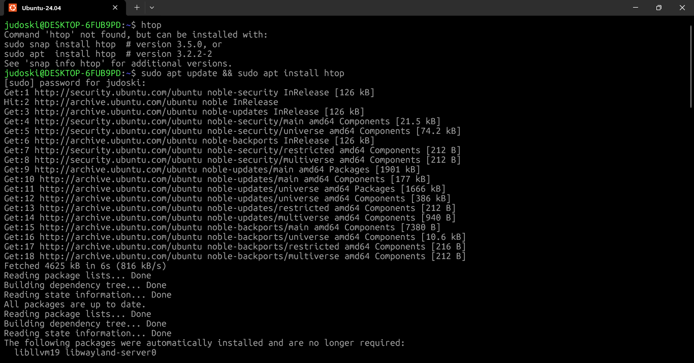
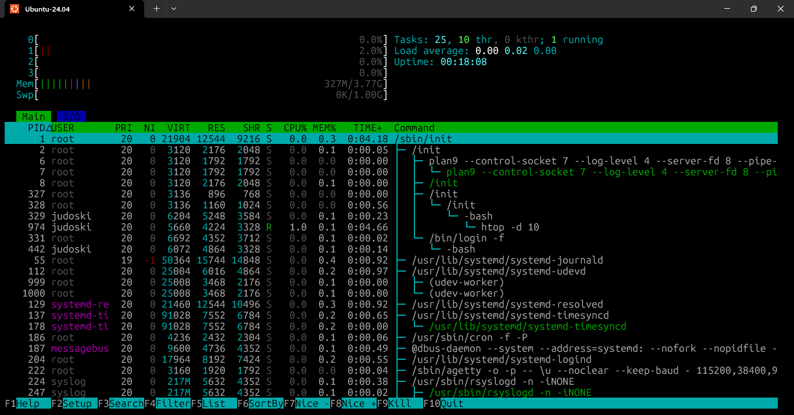
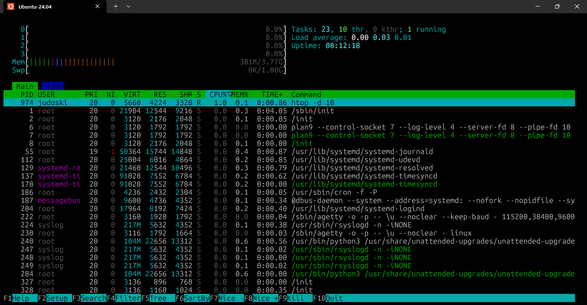
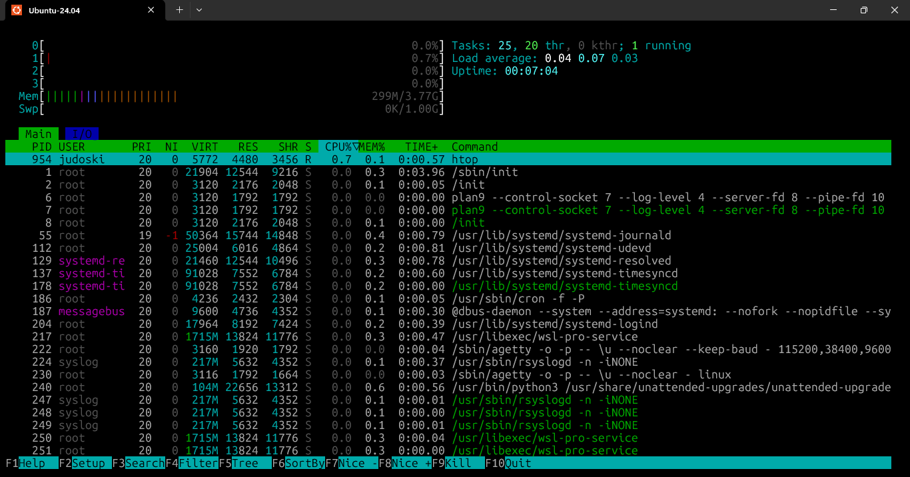

# **Day 18 – Process Management in Linux (htop, kill, nice)**

**30 Days of Linux Learning with Data Engineering Community**

---

## **Objective**

Today was about moving beyond observing the system to **actively controlling it**.

Focus areas:

* Real-time process monitoring (`htop`)
* Sending signals to processes (`kill`)
* Managing CPU priority (`nice`, `renice`)

This is where Linux shifts from commands → **resource control and system behavior**.

---

## **What I Learned**

### **1. Enhanced Process Monitoring with `htop`**

The first blocker:

```bash
htop: command not found
```

Resolution:

```bash
sudo apt install htop
```

👉 Linux doesn’t assume tools exist — **you build your environment**.

---

### **What `htop` Enables**

* Real-time CPU, memory, swap monitoring
* Interactive process management
* Sorting, filtering, searching
* Process hierarchy (tree view)
* Keyboard + mouse control

---

### **Syntax**

```bash
htop [options]
```

---

### **Common Options**

| Option     | Description                        |
| ---------- | ---------------------------------- |
| -d         | Sets delay between updates         |
| -u         | Show processes for a specific user |
| -p         | Monitor specific PIDs              |
| -s         | Sort by a column                   |
| -t         | Tree view (process hierarchy)      |
| --no-color | Disable colored output             |

---

### **Example**

```bash
htop -d 10
```


---

### **What I Observed**

* CPU (4 cores) → ~0% usage
* Memory → ~317MB / 3.77GB
* Load Avg → `0.03 0.03 0.00`

👉 Interpretation: **System is idle and underutilized**

---

### **Background Processes Insight**

* `systemd-resolved` → DNS resolution
* `timesyncd` → system time sync
* `unattended-upgrade` → security updates

👉 Even when idle, Linux is running **essential services**

---

### **Targeted Monitoring**

```bash
htop -p 329
```

---

### **Tree View (Critical for Debugging)**

```bash
htop -t
```

👉 Reveals **parent-child relationships**
Essential when tracing pipelines or chained jobs.

---

### **Interactive Controls**

#### Navigation

* Arrow Keys → Move
* Page Up/Down → Scroll
* Home/End → Jump

#### Process Actions

| Key | Action            |
| --- | ----------------- |
| F3  | Search            |
| F4  | Filter            |
| F5  | Tree view         |
| F6  | Sort              |
| F7  | Increase priority |
| F8  | Decrease priority |
| F9  | Kill process      |
| F10 | Quit              |

---

### **2. Process Control with `kill`**

Shift from **monitoring → controlling processes**

---

### **Basic Workflow**

```bash
sleep 1000 &
[1] 1104
```

```bash
kill 1104
```

👉 Sends **SIGTERM (15)** → graceful shutdown

---

### **Force Kill**

```bash
kill -9 1104
```

👉 SIGKILL → immediate termination (non-recoverable)

---

### **Signals Table**

| Signal  | Number | Purpose            |
| ------- | ------ | ------------------ |
| SIGHUP  | 1      | Reload config      |
| SIGINT  | 2      | Interrupt (Ctrl+C) |
| SIGKILL | 9      | Force kill         |
| SIGTERM | 15     | Graceful shutdown  |
| SIGCONT | 18     | Resume process     |
| SIGSTOP | 19     | Pause process      |

---

### **Ways to Send Signals**

#### By Number

```bash
kill -9 <PID>
```

#### With SIG Prefix

```bash
kill -SIGTERM <PID>
```

#### Without Prefix

```bash
kill -TERM <PID>
```

---

### **List Signals**

```bash
kill -l
```

---

### **Key Insight**

Before using `kill`, you must **identify the PID**

Tools:

* `ps`
* `top`
* `htop`

---

### **3. Process Priority (`nice` & `renice`)**

This is where system behavior becomes **strategic**

---

### **Nice Value Range**

```
-20 → Highest priority  
  0 → Default  
+19 → Lowest priority  
```

---

### **Create Low Priority Process**

```bash
nice -n 10 sleep 5000 &
[1] 1565
```

---

### **Verify**

```bash
ps -l | grep sleep
```

---

### **Breakdown**

* `1565` → PID
* `329` → Parent PID
* `S` → Sleeping
* `NI` → Nice value (10)

👉 Confirms **lower CPU priority**

---

### **Second Process**

```bash
nice -n 5 sleep 2500 &
[2] 1611
```

* `[2]` → Job number
* `1611` → PID

---

### **Renice (Modify Running Process)**

```bash
sudo renice -n -10 -p 1611
```

Output:

```
1611 old priority 5, new priority -10
```

👉 Priority increased significantly

---

### **Renice Targets**

| Flag | Target        | Example                 |
| ---- | ------------- | ----------------------- |
| -p   | Process ID    | renice -n 10 -p 1611    |
| -u   | User          | renice -n 10 -u judoski |
| -g   | Process Group | renice -n 10 -g 1000    |

---

### **Real Data Engineering Context**

* Batch jobs → lower priority
* Interactive workloads → higher priority

👉 Prevents pipelines from **blocking real-time tasks**

---

## **What I Built / Practiced**

* Installed missing system tool (`htop`)
* Monitored system performance in real-time
* Created background processes using `sleep`
* Terminated processes (graceful + force)
* Assigned custom priorities using `nice`
* Adjusted live process priority using `renice`
* Interpreted system metrics (CPU, memory, load)

---

## **Challenges Faced**

### **1. Command Not Found**

```bash
htop: command not found
```

✔ Fixed:

```bash
sudo apt install htop
```

---

### **2. Silent `grep` Output**

```bash
ps -el | grep terminal
```

✔ No result

👉 Reason:

* Process names ≠ assumed keywords
* Could be `bash`, `wsl`, etc.

👉 Lesson: **grep is literal**

---

### **3. Sudo Password Behavior**

* No visible typing

👉 Security feature: **blind typing**

---

### **4. Renice Group Confusion**

```bash
renice -g 1000
```

❌ Failed

👉 Insight:

* `-g` = Process Group ID (not user group)

✔ Fix:

```bash
sudo renice -n 5 -u judoski
```

---

## **Key Takeaways**

* `htop` → real-time + interactive monitoring
* `kill` → signal-driven process control
* `nice` → set priority at launch
* `renice` → adjust priority dynamically
* Errors = **system feedback, not failure**

---

## **Resources**

* Data Engineering Community
* geeksforgeeks 
(signal reference)

---

## **Output**

* Successfully monitored system processes in real-time
* Controlled background processes using signals
* Tuned CPU priority across multiple processes
* Diagnosed and resolved real Linux errors
* Built practical understanding of **process lifecycle + resource allocation**

---











