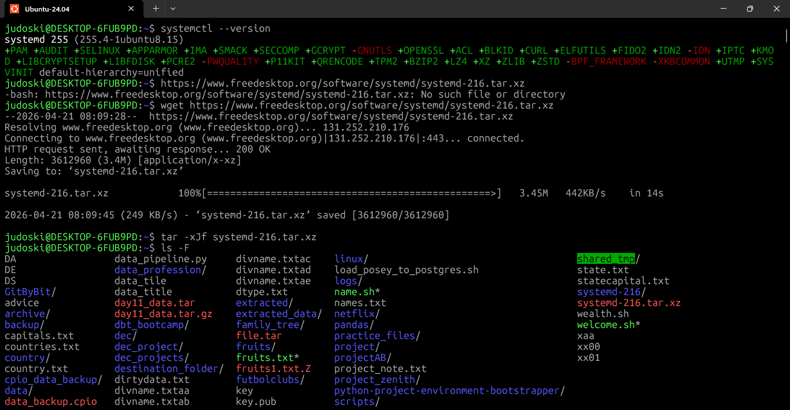
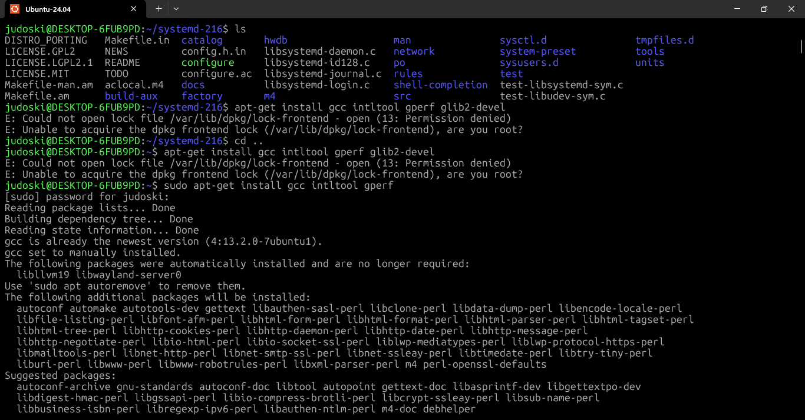
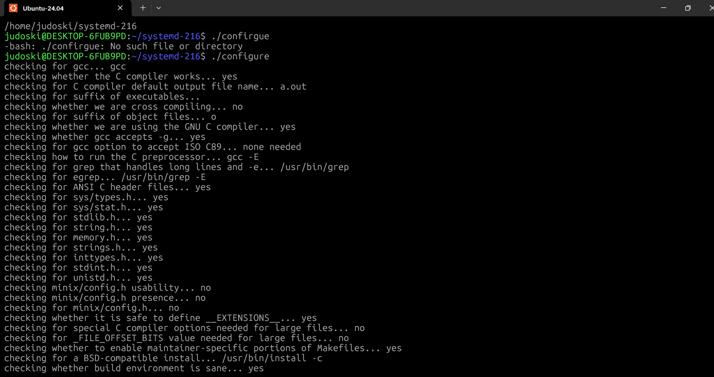
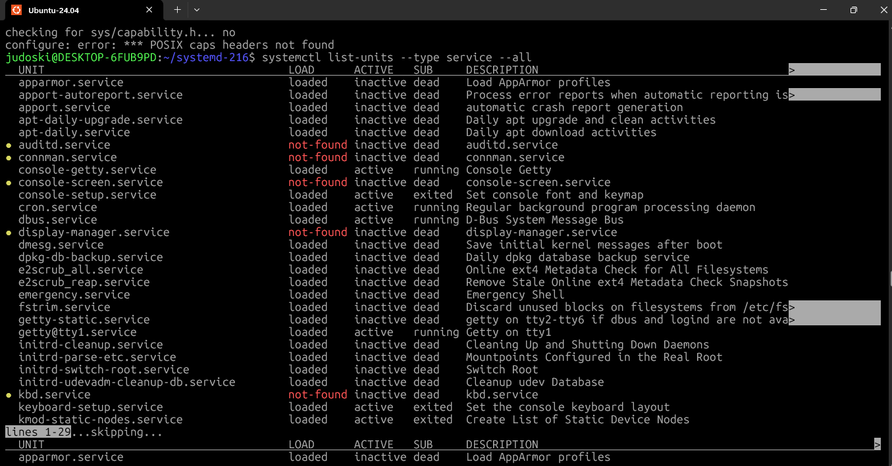
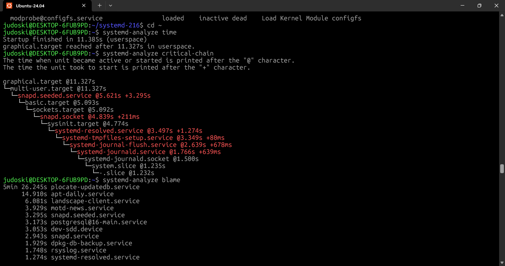
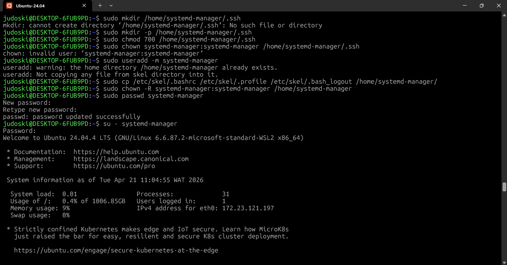

# **Day 19 – System Services & systemd**

**30 Days of Linux Learning with Data Engineering Community**

---

## **Objective**

Today shifted my understanding from **managing processes → managing the entire system lifecycle**.

The focus was on:

* How Linux boots using `systemd`
* How services are controlled (`systemctl`)
* How logs are analyzed (`journalctl`)
* How to diagnose system performance (`systemd-analyze`)

This is where Linux stops being a terminal tool and becomes **an orchestrated system**.

---

## **What I Learned**

### **1. What systemd Really Is**

`systemd` is the **first user-space process (PID 1)** that takes control after the kernel.

It is responsible for:

* Initializing the system during boot
* Managing all services and background processes
* Handling dependencies between services
* Ensuring system stability and recovery

👉 Every process you run traces back to systemd.

---

### **2. Core systemd Utilities**

| Tool           | Purpose                                        |
| -------------- | ---------------------------------------------- |
| `systemctl`    | Control services (start, stop, enable, status) |
| `journalctl`   | View and filter logs                           |
| `hostnamectl`  | Manage hostname                                |
| `timedatectl`  | Manage system time                             |
| `localectl`    | Configure locale                               |
| `systemd-cgls` | View process hierarchy                         |

👉 `systemctl` + `journalctl` = **core operational toolkit**

---

### **3. Boot Process (What Actually Happens)**

Linux boot is not magic—it’s a pipeline:

| Stage      | Role                    |
| ---------- | ----------------------- |
| BIOS/UEFI  | Hardware initialization |
| Bootloader | Loads kernel            |
| Kernel     | Mounts filesystem       |
| systemd    | Starts all services     |

👉 systemd takes over and builds the entire system state.

---

### **4. systemd Targets (System States)**

Instead of runlevels, systemd uses **targets**:

| Target              | Meaning          |
| ------------------- | ---------------- |
| `multi-user.target` | CLI + networking |
| `graphical.target`  | Full GUI         |
| `rescue.target`     | Recovery mode    |
| `emergency.target`  | Minimal system   |

👉 A target = **final system state**

---

### **5. Boot Performance Analysis**

#### **Check Total Boot Time**

```bash
systemd-analyze time
```

Output:

```
Startup finished in 11.385s (userspace)
graphical.target reached after 11.327s
```

👉 Insight:

* No kernel time (WSL environment)
* ~11s boot → efficient system

---

#### **Dependency Chain (Critical for Debugging)**

```bash
systemd-analyze critical-chain
```

Key idea:

* `@` → when service started
* `+` → how long it took

👉 This reveals **startup bottlenecks**

---

#### **Find Slow Services**

```bash
systemd-analyze blame
```

Example:

```
5min 26s plocate-updatedb.service
14.9s apt-daily.service
```

👉 This is **real performance debugging**

In data engineering terms:

* This = identifying **slow pipeline stages**

---

## **What I Built / Practiced**

### **1. Managing Services with systemctl**

```bash
systemctl start apache2
systemctl stop apache2
systemctl status apache2
```

---

### **2. Core systemctl Options**

| Option     | Description          | Example                               |
| ---------- | -------------------- | ------------------------------------- |
| `--type`   | Filter by unit type  | `systemctl --type=service`            |
| `--all`    | Show all units       | `systemctl --all`                     |
| `--failed` | Show failed services | `systemctl --failed`                  |
| `--state`  | Filter by state      | `systemctl list-units --state=failed` |
| `--user`   | User-level services  | `systemctl --user`                    |

---

### **3. Service Lifecycle Management**

| Action        | Command                     |
| ------------- | --------------------------- |
| Start         | `systemctl start service`   |
| Stop          | `systemctl stop service`    |
| Restart       | `systemctl restart service` |
| Reload        | `systemctl reload service`  |
| Enable (boot) | `systemctl enable service`  |
| Disable       | `systemctl disable service` |

---

### **4. Masking vs Unmasking**

| Action   | Meaning                  |
| -------- | ------------------------ |
| `mask`   | Completely block service |
| `unmask` | Allow service again      |

---

### **5. Working with Logs (journalctl)**

#### **Basic Usage**

```bash
journalctl
```

---

#### **Useful Commands**

| Task            | Command                 |
| --------------- | ----------------------- |
| Reverse logs    | `journalctl -r`         |
| Last 20 logs    | `journalctl -n 20`      |
| Filter service  | `journalctl -u apache2` |
| Filter priority | `journalctl -p warning` |
| Verbose output  | `journalctl -o verbose` |

---

#### **Real Debugging Example**

```bash
journalctl -u apache2 -n 20
```

👉 This shows **recent service behavior**

---

### **6. Remote systemd Control**

```bash
systemctl --host user@server status nginx
```

👉 This is how real engineers manage **remote servers**

---

## **Challenges Faced**

### **1. Understanding PID 1**

At first, it felt abstract.

Then it clicked:

👉 systemd = **root of all processes**

---

### **2. Boot Analysis Interpretation**

Seeing:

```
@11.327s +3.295s
```

Initially confusing.

Now clear:

* `@` → start time
* `+` → duration

---

### **3. Slow Services Insight**

A service taking **5 minutes** stood out.

👉 That’s not normal.

👉 That’s optimization opportunity.

---

### **4. Log Overload**

Running:

```bash
journalctl
```

→ massive output

Solution:

* Use filters (`-n`, `-u`, `-p`)

👉 Logs are powerful only when filtered.

---

## **Key Takeaways**

* systemd = **system orchestrator**
* `systemctl` = control layer
* `journalctl` = visibility layer
* `systemd-analyze` = performance layer
* Targets define system states
* Logs + services = real debugging

---

## **Resources**

* `man systemctl`
* `man journalctl`
* `man systemd`
* `systemd-analyze --help`

---

## **Output**

Today I moved from:

👉 Running commands
to
👉 Understanding how the system boots, runs, and recovers

I can now:

* Control services in real time
* Diagnose slow boot processes
* Analyze logs for failures
* Understand system dependencies

This is the layer where Linux becomes **production-ready knowledge**.

---












