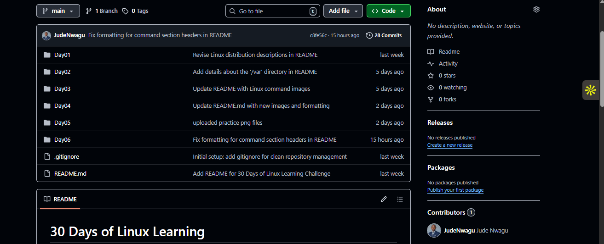
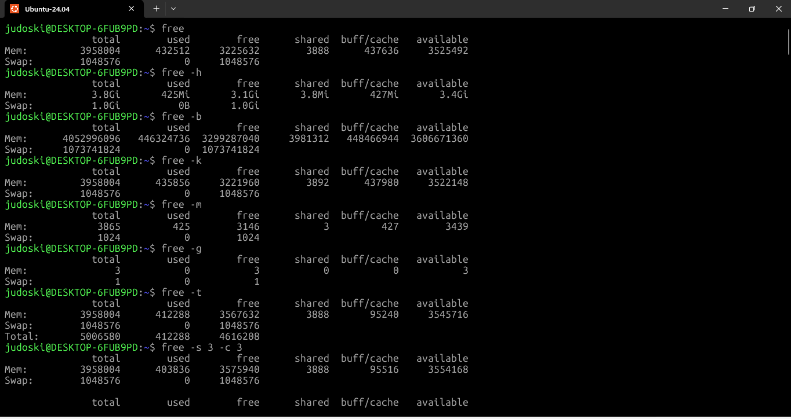
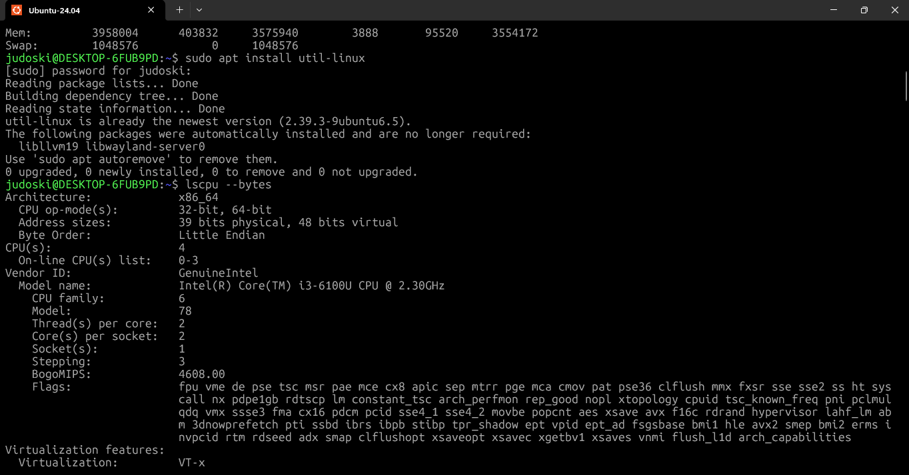
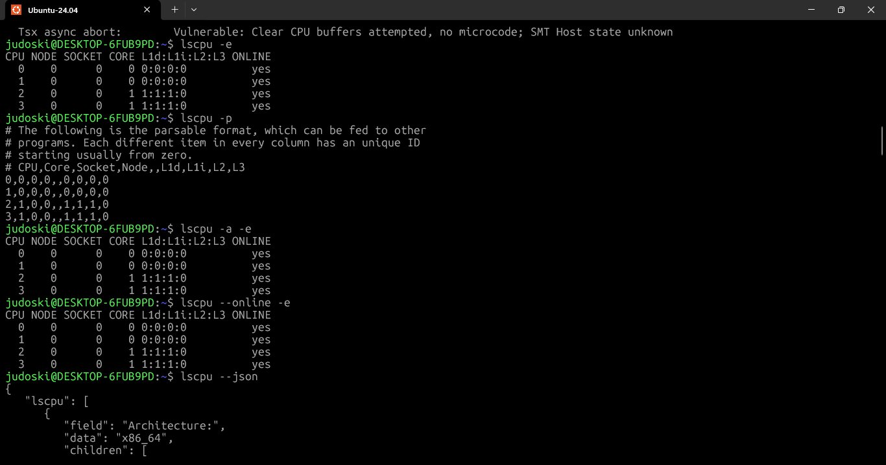
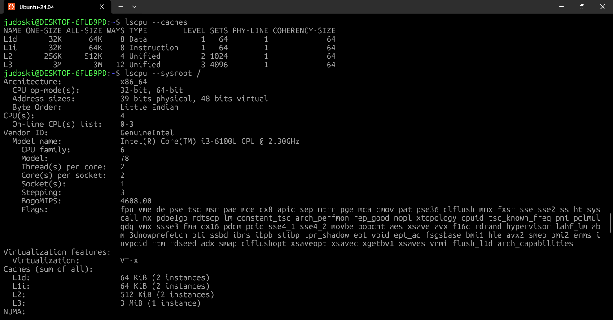
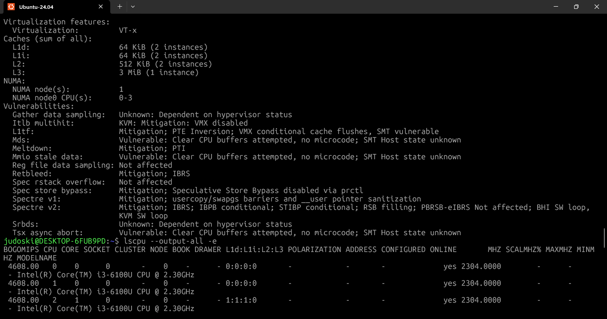

# **Day 20 – System Monitoring (Part 1: Disk, Memory, CPU)**

**30 Days of Linux Learning with Data Engineering Community**

---

## **Objective**

Today was about moving from *process control* (Day 18) and *service management* (Day 19) into **observability**.

The goal was simple:

> Understand how to read system state in real time — across **storage, memory, and CPU**  and interpret what those numbers actually mean.

This is the layer where Linux becomes a **monitoring system**, not just an operating system.

---

## **What I Learned**

System monitoring in Linux is not about running commands 
it is about **reading system signals and making decisions from them**.

Three core areas covered:

* **Disk usage → `df`**
* **Memory usage → `free`**
* **CPU architecture → `lscpu`**

Each tool answers a different question:

* Do I have enough storage?
* Do I have enough memory?
* What hardware is this system running on?

---

# **1. Disk Monitoring using `df`**

The `df` command shows how much disk space is available across mounted file systems.

### **What `df` Actually Tells You**

* Total storage capacity
* Used space
* Free space
* % utilization
* Where each filesystem is mounted

---

## **Example: Default Output**

```bash
judoski@DESKTOP-6FUB9PD:~$ df
```

```
Filesystem      1K-blocks      Used Available Use% Mounted on
none              1979000         0   1979000   0% /usr/lib/modules/6.6.87.2-microsoft-standard-WSL2
none              1979000         4   1978996   1% /mnt/wsl
drivers         249319420 224768348  24551072  91% /usr/lib/wsl/drivers
/dev/sdd       1055762868   3960552 998098844   1% /
```

### **Interpretation**

* `/dev/sdd` → your main Linux filesystem → only **1% used**
* `drivers` → mounted Windows partition → **91% full**

👉 Insight:
Even if Linux looks “empty”, underlying host storage (Windows) can still be a bottleneck.

---

## **Human Readable Output**

```bash
judoski@DESKTOP-6FUB9PD:~$ df -h
```

```
Filesystem      Size  Used Avail Use% Mounted on
drivers         238G  215G   24G  91% /usr/lib/wsl/drivers
/dev/sdd       1007G  3.8G  952G   1% /
```

👉 This is the version you actually use in real work.

---

## **Key Options for `df`**

| Option  | Description                 |
| ------- | --------------------------- |
| -h      | Human-readable format       |
| -i      | Show inode usage            |
| -T      | Show filesystem type        |
| --total | Show total usage            |
| -t TYPE | Filter by filesystem type   |
| -x TYPE | Exclude filesystem type     |
| -l      | Show only local filesystems |

---

## **Inode-Level Monitoring**

```bash
judoski@DESKTOP-6FUB9PD:~$ df -i
```

👉 This was a key shift:

> Disk space is not the only limit — **inodes can run out first**

Even with free space, no inodes = no new files.

---

## **Learning Moment**

```bash
judoski@DESKTOP-6FUB9PD:~$ df -t log
```

❌ Failed

👉 Lesson:

* `-t` expects filesystem type (e.g., ext4), not folder name

---

# **2. Memory Monitoring using `free`**

The `free` command shows how RAM and swap are being used.

---

## **Default Output**

```bash
judoski@DESKTOP-6FUB9PD:~$ free
```

```
               total        used        free      shared  buff/cache   available
Mem:         3958004      432512     3225632        3888      437636     3525492
Swap:        1048576           0     1048576
```

---

## **What These Columns Actually Mean**

* **total** → installed RAM
* **used** → memory actively used by processes
* **free** → completely unused
* **buff/cache** → memory reserved for performance
* **available** → actual usable memory

👉 Critical Insight:

> Linux *uses free memory for caching* — this is **optimization, not waste**

---

## **Human Readable View**

```bash
judoski@DESKTOP-6FUB9PD:~$ free -h
```

```
Mem:   3.8Gi   425Mi   3.1Gi
Swap:  1.0Gi     0B    1.0Gi
```

👉 Your system is:

* Memory usage → low
* Swap usage → 0 (healthy system)

---

## **Monitoring Over Time**

```bash
judoski@DESKTOP-6FUB9PD:~$ free -s 3 -c 3
```

👉 This turns `free` into a **lightweight monitoring tool**

---

## **Key Options**

| Option | Description          |
| ------ | -------------------- |
| -h     | Human-readable       |
| -m     | MB format            |
| -g     | GB format            |
| -t     | Show totals          |
| -s     | Repeat interval      |
| -c     | Count of repetitions |

---

## **System Insight**

This command answers:

> “Do I need more memory or better process control?”

---

# **3. CPU Inspection using `lscpu`**

Unlike `df` and `free`, `lscpu` is not about usage —
it is about **understanding the hardware itself**.

---

## **Basic Command**

```bash
judoski@DESKTOP-6FUB9PD:~$ lscpu
```

👉 Shows:

* Architecture (x86_64)
* CPU modes (32/64 bit)
* Number of cores
* Threads
* Cache sizes

---

## **Extended Output**

```bash
judoski@DESKTOP-6FUB9PD:~$ lscpu -e
```

👉 Displays:

* CPU → core mapping
* Socket info
* NUMA nodes

---

## **Parse Format (Automation Ready)**

```bash
judoski@DESKTOP-6FUB9PD:~$ lscpu -p
```

👉 Outputs in CSV-style format → useful for scripting

---

## **Cache Inspection**

```bash
judoski@DESKTOP-6FUB9PD:~$ lscpu --caches
```

👉 Shows L1, L2, L3 cache

---

## **Key Options**

| Option   | Description     |
| -------- | --------------- |
| -e       | Extended output |
| -p       | Parse format    |
| -a       | All CPUs        |
| --online | Active CPUs     |
| --json   | JSON output     |
| --caches | Cache details   |

---

## **System Insight**

This command answers:

> “What is the system capable of handling?”

---

## **What I Built / Practiced**

* Monitored disk usage across mounted systems
* Compared Linux vs Windows storage behavior (WSL context)
* Tracked memory allocation and caching behavior
* Simulated real-time monitoring using `free -s`
* Inspected CPU structure and architecture

---

## **Challenges Faced**

### **1. Misinterpreting Disk Usage**

Seeing 1% usage → assumed system is empty

👉 Reality:

* Linux partition ≠ total system storage

---

### **2. Filtering Error with `df -t`**

Used incorrect filter value

👉 Learned:

* Always match **system-level types**, not human labels

---

### **3. Memory Misconception**

Initially thought high cache = problem

👉 Learned:

* Cache = performance optimization

---

## **Key Takeaways**

* `df` → storage capacity and limits
* `free` → memory allocation and pressure
* `lscpu` → hardware capability

More importantly:

> Monitoring is not about numbers — it’s about **interpreting system behavior**

---

## **Resources**

* `man df`
* `man free`
* `man lscpu`

---

## **Output**

At the end of today:

* I can **read disk, memory, and CPU state confidently**
* I understand how Linux optimizes resource usage
* I can identify early signs of system bottlenecks

---

## **Final Reflection**

Today shifted my mindset again.

I am no longer just:

* running commands
* managing processes

I am now:

> **observing system health in real time**

This is exactly what matters in data engineering:

* Large datasets → disk pressure
* Pipelines → memory usage
* Compute jobs → CPU constraints

If you can’t monitor it,
you can’t optimize it.













