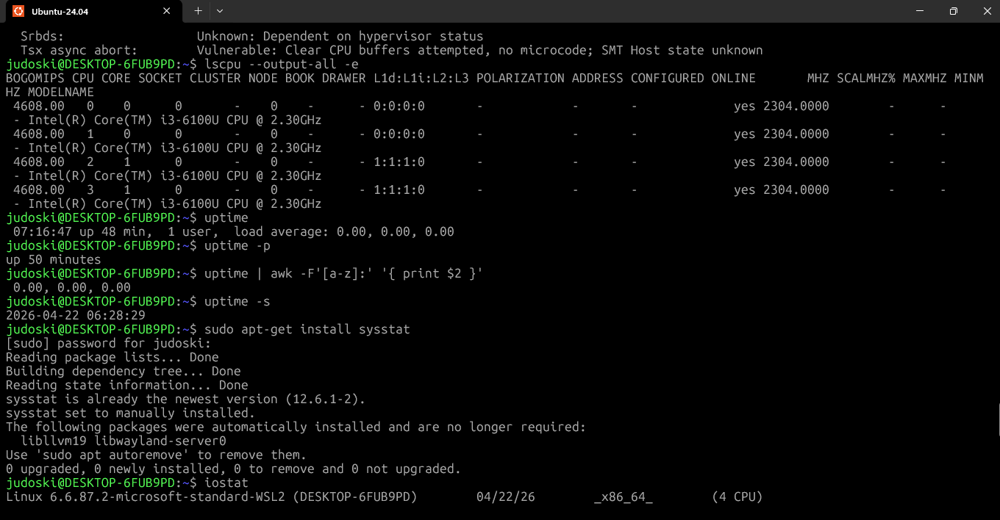
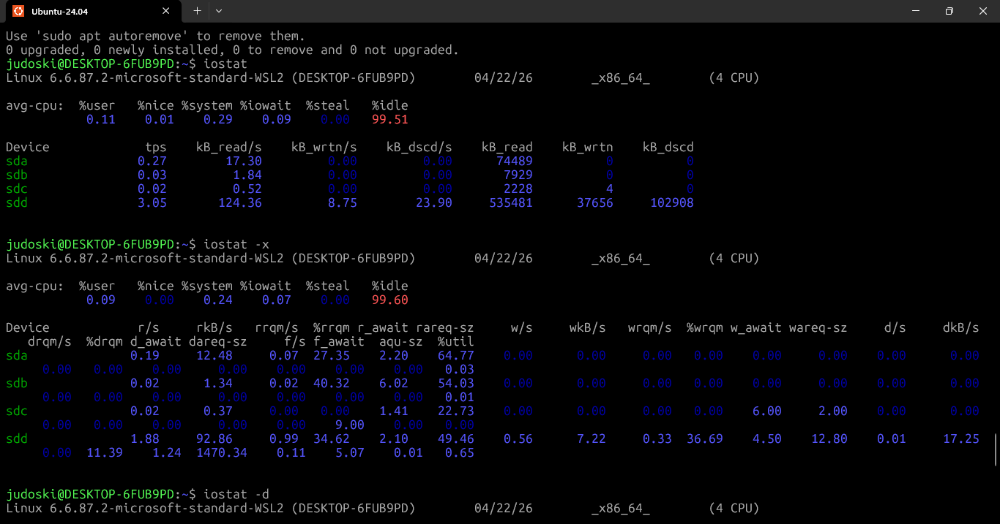
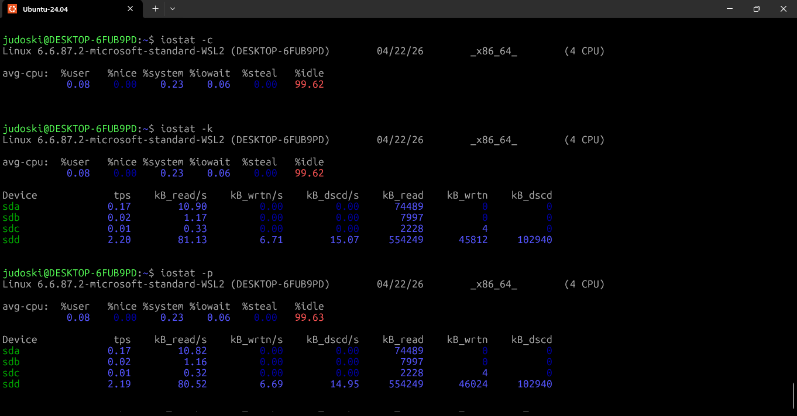
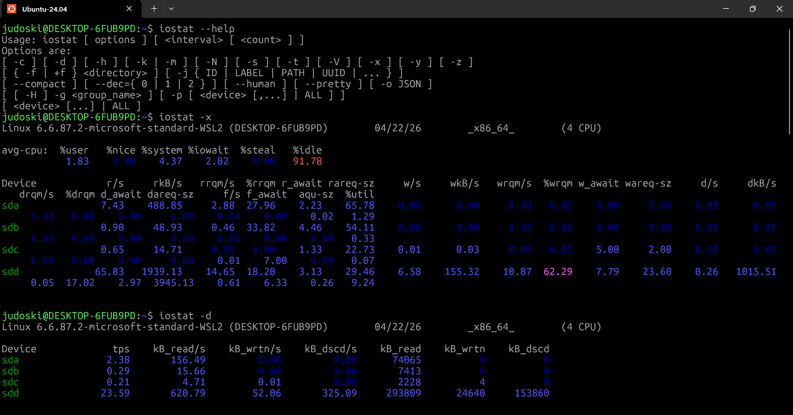
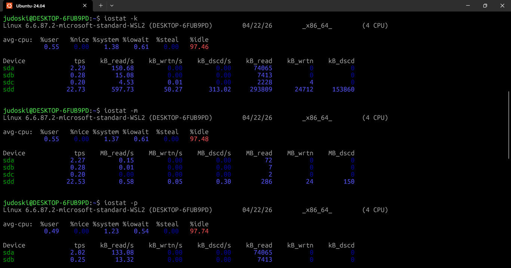
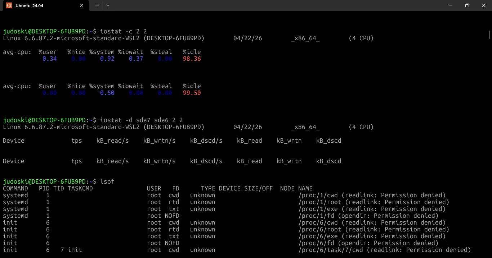
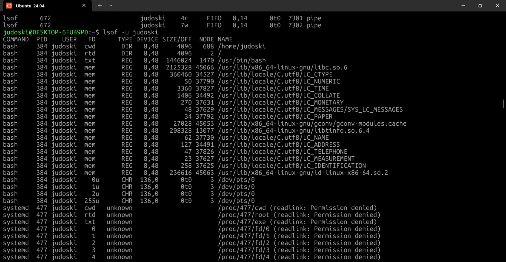
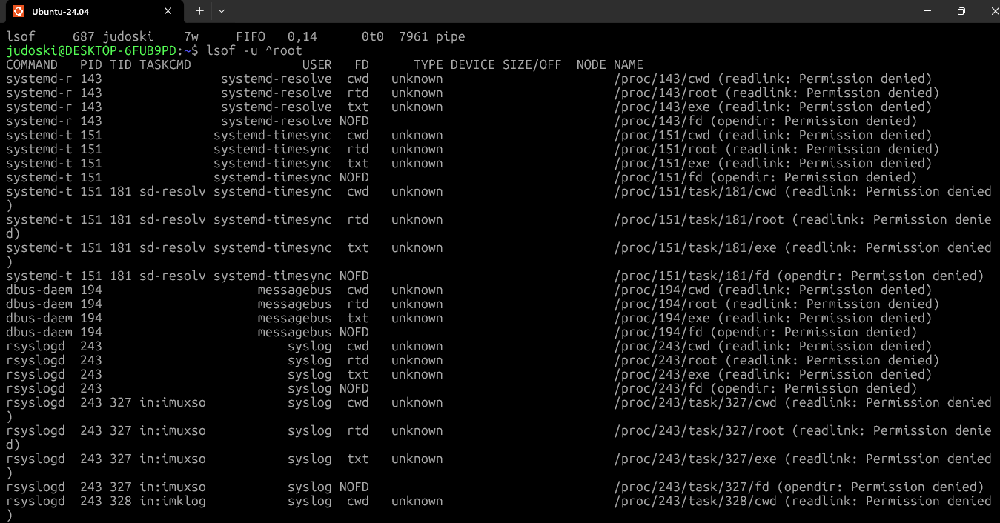
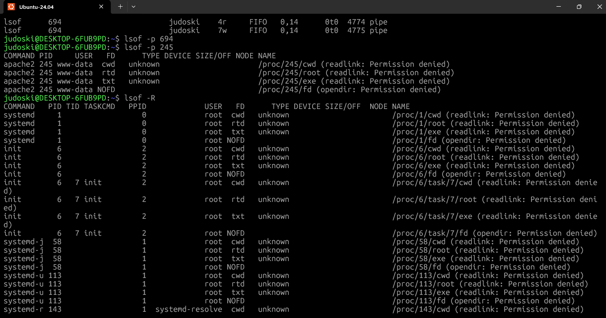

# **Day 21 – System Monitoring Part 2 (uptime, iostat, lsof)**

**30 Days of Linux Learning with Data Engineering Community**

---

## **Objective**

Today was not just about checking if the system is running —
it was about understanding **how stable, how busy, and what exactly is using system resources**.

The focus was on:

* System stability → `uptime`
* Disk + CPU performance → `iostat`
* File & process relationships → `lsof`

This is where monitoring moves from **surface-level observation → deep system visibility**.

---

## **What I Learned**

---

# **1. System Health Check using `uptime`**

At first glance, `uptime` looks simple.
But it actually gives **three critical signals in one line**:

```bash
judoski@DESKTOP-6FUB9PD:~$ uptime
07:16:47 up 48 min,  1 user,  load average: 0.00, 0.00, 0.00
```

### **Breaking it Down**

| Metric       | Meaning                                |
| ------------ | -------------------------------------- |
| Current Time | 07:16:47                               |
| Uptime       | System has been running for 48 minutes |
| Users        | 1 active user session                  |
| Load Average | CPU demand over time                   |

---

## **Understanding Load Average (Critical Insight)**

```
0.00, 0.00, 0.00
```

These represent:

* Last 1 minute
* Last 5 minutes
* Last 15 minutes

👉 This is not CPU usage — it is **system demand**.

### **Interpretation**

| Load Value | Meaning                         |
| ---------- | ------------------------------- |
| 0.00       | Idle system                     |
| 1.00       | Fully utilized (for 1 CPU core) |
| >1.00      | System under pressure           |

👉 On multi-core systems, compare load to number of cores.

---

## **Human Readable Output**

```bash
judoski@DESKTOP-6FUB9PD:~$ uptime -p
up 50 minutes
```

---

## **Extracting Load for Automation**

```bash
judoski@DESKTOP-6FUB9PD:~$ uptime | awk -F'[a-z]:' '{ print $2 }'
0.00, 0.00, 0.00
```

👉 This is how monitoring scripts isolate key metrics.

---

## **Key Realization**

`uptime` is your **first diagnostic command**.

Before checking CPU, memory, or disk:

👉 Ask: *Is the system under load?*

---

# **2. Disk & CPU Performance using `iostat`**

This is where things became more analytical.

Unlike `htop`, which shows *current activity*,
`iostat` shows **performance behavior over time**.

---

## **Basic Command**

```bash
judoski@DESKTOP-6FUB9PD:~$ iostat
```

Output is divided into:

1. CPU Report (`avg-cpu`)
2. Device Report (Disk activity)

---

## **CPU Report (avg-cpu Section)**

| Metric  | Meaning                      |
| ------- | ---------------------------- |
| %user   | Time spent on user processes |
| %system | Kernel operations            |
| %iowait | Waiting for disk operations  |
| %idle   | CPU not doing work           |

### **Interpretation**

If `%iowait` is high:

👉 CPU is idle, but waiting on disk
👉 This is a **storage bottleneck**, not CPU issue

---

## **Device Utilization Report**

This is where real system insight comes from.

| Metric    | Meaning                    |
| --------- | -------------------------- |
| tps       | Transfers per second       |
| kB_read/s | Read speed                 |
| kB_wrtn/s | Write speed                |
| %util     | Disk busy percentage       |
| await     | Time taken per I/O request |

---

## **Example Insight**

If you see:

* High `await`
* High `%util`

👉 Disk is overloaded
👉 System slowdown is coming from storage

---

## **Extended Analysis**

```bash
iostat -x
```

This introduces deeper metrics:

| Metric   | Meaning         |
| -------- | --------------- |
| await    | Total latency   |
| svctm    | Service time    |
| avgqu-sz | Queue length    |
| %util    | Disk saturation |

---

## **Monitoring Over Time**

```bash
judoski@DESKTOP-6FUB9PD:~$ iostat -k 2 3
```

👉 Every 2 seconds, 3 reports

This transforms `iostat` into a **live monitoring tool**.

---

## **Key Realization**

`iostat` answers:

👉 *Is the system slow because of CPU or disk?*

This is critical in:

* Data pipelines
* ETL jobs
* Database systems

---

# **3. Process–File Relationship using `lsof`**

This was the most eye-opening part.

In Linux:

👉 **Everything is a file**

And `lsof` shows:

👉 *Which process is using which file*

---

## **Basic Command**

```bash
lsof
```

This lists:

* Files
* Processes
* Network connections

---

## **Understanding Output**

| Column  | Meaning         |
| ------- | --------------- |
| COMMAND | Process name    |
| PID     | Process ID      |
| USER    | Owner           |
| FD      | File descriptor |
| TYPE    | File type       |
| NAME    | File path       |

---

## **File Descriptor Types**

| FD   | Meaning            |
| ---- | ------------------ |
| cwd  | Current directory  |
| txt  | Executable         |
| mem  | Memory-mapped file |
| REG  | Regular file       |
| DIR  | Directory          |
| IPv4 | Network connection |

---

## **Filter by User**

```bash
judoski@DESKTOP-6FUB9PD:~$ lsof -u judoski
```

---

## **Filter by Process**

```bash
lsof -p <PID>
```

---

## **Check Network Connections**

```bash
lsof -i
```

Or:

```bash
lsof -i tcp
```

---

## **Real Use Case**

If a file cannot be deleted:

👉 It is likely still open by a process

Use:

```bash
lsof filename
```

---

## **Key Realization**

`lsof` connects:

👉 Processes ↔ Files ↔ Network

This is critical for:

* Debugging file locks
* Tracking open ports
* Investigating system issues

---

## **What I Built / Practiced**

Today was not passive learning.

I actively:

* Checked system load using `uptime`
* Monitored CPU vs disk bottlenecks using `iostat`
* Tracked open files and active processes using `lsof`
* Simulated monitoring intervals with `iostat`
* Filtered process-level activity with `lsof`

---

## **Challenges Faced**

---

### **1. Misinterpreting Load Average**

At first, I assumed:

👉 Load = CPU usage

✔ Correction:

👉 Load = **demand on CPU**

---

### **2. Understanding iostat Metrics**

Metrics like:

* `await`
* `%util`

Were not obvious initially

✔ Lesson:

👉 High `%util` ≠ high performance
👉 It often means **resource saturation**

---

### **3. lsof Output Overload**

Running:

```bash
lsof
```

Produced too much data

✔ Lesson:

👉 Always filter:

* By user
* By process
* By network

---

## **Key Takeaways**

* `uptime` → quick system health check
* `iostat` → disk + CPU performance analysis
* `lsof` → process-to-file visibility
* Load average ≠ CPU usage
* Disk bottlenecks are a major cause of slow systems
* Everything in Linux is treated as a file

---

## **Resources**

* Data Engineering Community Resource
* Geeksforgeeks
  

---

## **Output**

```bash
judoski@DESKTOP-6FUB9PD:~$ uptime
07:16:47 up 48 min,  1 user,  load average: 0.00, 0.00, 0.00

judoski@DESKTOP-6FUB9PD:~$ uptime -p
up 50 minutes

judoski@DESKTOP-6FUB9PD:~$ iostat -k 2 3

judoski@DESKTOP-6FUB9PD:~$ lsof -u judoski
```

---

## **Final Reflection**

Today changed how I look at system performance.

Instead of guessing why a system is slow, I can now:

* Check system load instantly
* Identify whether the issue is CPU or disk
* Trace which processes are holding system resources

This is the difference between:

👉 Running commands
👉 And **understanding system behavior in real time**

---




















