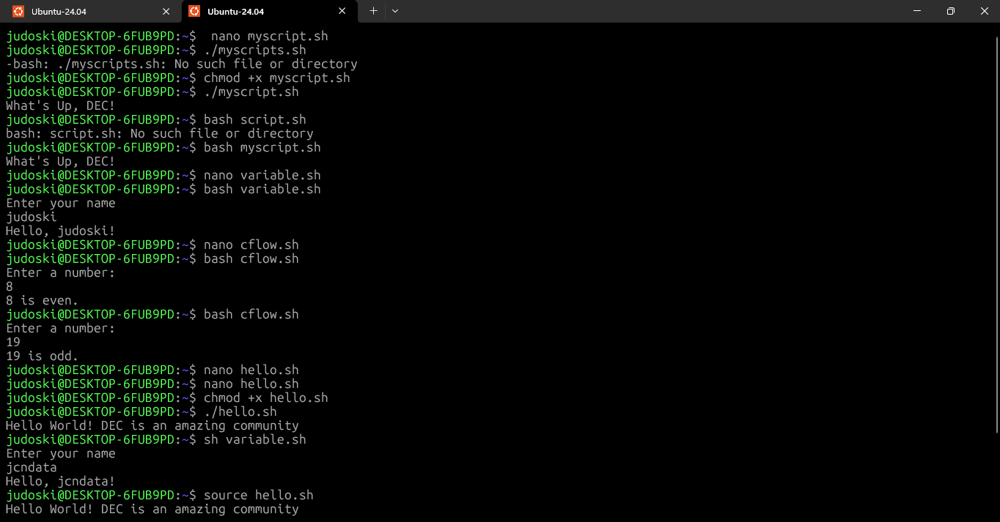
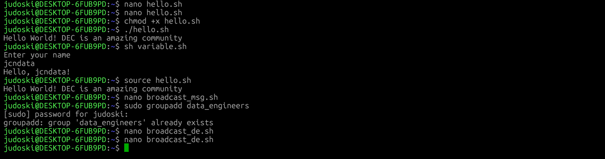
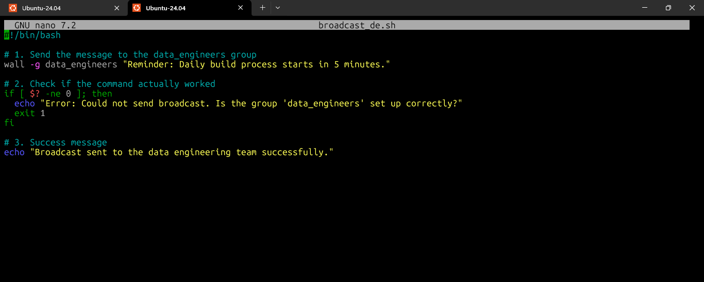

# Day 23 – Creating and Running Shell Scripts

30 Days of Linux Learning with Data Engineering Community

---

## Objective

Today moved from understanding **how the shell works (Day 22)** to actually **building with it**.

The goal was clear:

**Learn how to write, execute, and control shell scripts and understand how automation really works in Linux.**

This is where Linux shifts from:

* running commands manually
  to
* building repeatable systems

---

## What I Learned

Shell scripting is not just about writing commands in a file.

It is about:

* Turning manual operations into reusable programs
* Controlling execution flow
* Handling input and logic
* Making the system work *for you* instead of reacting to it

At a high level, scripting answers this question:

**“How do I automate what I already know how to do manually?”**

---

## 1. Writing Your First Shell Script

### Step 1: Creating the Script File

Everything starts with a text file.

```bash
judoski@DESKTOP-6FUB9PD:~$ nano myscript.sh
```

👉 This is where logic lives.
👉 `.sh` is just a convention what matters is the content.

---

### Step 2: Script Structure

```bash
#!/bin/bash

# This is a simple shell script

echo "What's Up, DEC!"
```

---

### What Each Part Means

| Component     | Purpose                                 |
| ------------- | --------------------------------------- |
| `#!/bin/bash` | Defines the interpreter (Bash)          |
| `# comment`   | Documentation, ignored during execution |
| `echo`        | Outputs text to terminal                |

---

### Critical Insight

That first line:

```bash
#!/bin/bash
```

is not optional in real systems.

👉 It defines **how your script will be executed**
👉 Without it, behavior becomes inconsistent across environments

---

### Step 3: Making Script Executable

```bash
judoski@DESKTOP-6FUB9PD:~$ chmod +x myscript.sh
```

👉 This changes permission from:

* just a file
  to
* an executable program

---

### Step 4: Running the Script

```bash
judoski@DESKTOP-6FUB9PD:~$ ./myscript.sh
```

👉 `./` means:

> run from current directory

---

## 2. Different Ways to Execute Scripts

### Method 1: Using Bash

```bash
judoski@DESKTOP-6FUB9PD:~$ bash myscript.sh
```

👉 Runs script using Bash explicitly
👉 Does NOT require execute permission

---

### Method 2: Using sh

```bash
judoski@DESKTOP-6FUB9PD:~$ sh myscript.sh
```

👉 Uses system default shell
👉 May behave differently depending on system

---

### Method 3: Using source

```bash
judoski@DESKTOP-6FUB9PD:~$ source myscript.sh
```

👉 Runs inside current shell
👉 No new process created

---

### Execution Comparison

| Method             | New Shell? | Needs chmod? | Use Case            |
| ------------------ | ---------- | ------------ | ------------------- |
| `bash script.sh`   | Yes        | No           | Safe execution      |
| `sh script.sh`     | Yes        | No           | Portable scripts    |
| `./script.sh`      | Yes        | Yes          | Standard execution  |
| `source script.sh` | No         | No           | Environment changes |

---

## 3. Variables and User Input

Scripts become powerful when they interact with users.

```bash
#!/bin/bash

echo "Enter your name:"
read name

echo "Hello, $name!"
```

---

### What’s Happening

| Element | Role                |
| ------- | ------------------- |
| `read`  | Captures user input |
| `name`  | Stores value        |
| `$name` | Retrieves value     |

---

### System Insight

This is the foundation of:

* dynamic scripts
* parameter-driven workflows
* automation pipelines

---

## 4. Control Flow (Decision Making)

```bash
#!/bin/bash

echo "Enter a number:"
read num

if [ $((num % 2)) -eq 0 ]; then
  echo "$num is even."
else
  echo "$num is odd."
fi
```

---

### What This Introduces

| Concept  | Purpose               |
| -------- | --------------------- |
| `if`     | Conditional logic     |
| `$(( ))` | Arithmetic evaluation |
| `-eq`    | Comparison operator   |

---

### Engineering Insight

This is where scripts move from:

* static execution
  to
* **decision-driven systems**

---

## 5. Understanding Shebang (#!/bin/bash)

### Format

```
#!/path/to/interpreter
```

---

### Why It Matters

The shebang ensures:

* correct interpreter is used
* script behaves consistently
* portability across systems

---

### Example

```bash
#!/bin/bash
echo "Hello World!"
```

---

### Without Shebang

```bash
echo "This is a test"
```

👉 System guesses interpreter
👉 May fail depending on environment

---

### Bash vs sh

| Feature            | Bash     | sh               |
| ------------------ | -------- | ---------------- |
| Advanced scripting | Yes      | Limited          |
| Portability        | Moderate | High             |
| Default usage      | Common   | System dependent |

---

## 6. Running Scripts as Real Programs

### Make Executable

```bash
judoski@DESKTOP-6FUB9PD:~$ chmod +x demo.sh
```

### Run

```bash
judoski@DESKTOP-6FUB9PD:~$ ./demo.sh
```

---

### Insight

At this point:

👉 Your script behaves like a native Linux command

---

## 7. Automating Communication (wall & write)

### Broadcast Message

```bash
#!/bin/bash
wall "System maintenance starts in 15 minutes."
```

---

### Send to Specific User

```bash
echo "Hello Jude" | write judoski
```

---

### Use Case

| Tool    | Purpose               |
| ------- | --------------------- |
| `wall`  | System-wide alerts    |
| `write` | Direct user messaging |

---

## 8. Output Redirection (Saving Results)

### Overwrite

```bash
judoski@DESKTOP-6FUB9PD:~$ ls > sample.txt
```

---

### Append

```bash
judoski@DESKTOP-6FUB9PD:~$ date >> sample.txt
```

---

### Behavior

| Operator | Action          |
| -------- | --------------- |
| `>`      | Overwrites file |
| `>>`     | Appends to file |

---

### Insight

This is critical for:

* logging
* data pipelines
* debugging

---

## What I Built / Practiced

* Created and executed shell scripts from scratch
* Used multiple execution methods (bash, sh, source)
* Captured user input using `read`
* Implemented logic using `if` statements
* Understood and applied shebang correctly
* Automated system messaging using `wall` and `write`
* Saved command outputs using redirection

---

## Challenges Faced

### 1. Script Not Running with ./

👉 Cause: Missing execute permission

👉 Fix:

```bash
chmod +x script.sh
```

---

### 2. Running Without Shebang

👉 Result: Inconsistent behavior

👉 Lesson:
Always define interpreter

---

### 3. Confusion Between bash and source

👉 Learned:

* `bash` → new shell
* `source` → same shell

---

## Key Takeaways

* Shell scripts = automation layer of Linux
* Shebang defines execution behavior
* Execution method affects environment
* Variables + control flow = dynamic scripts
* Redirection enables logging and persistence

Most importantly:

**A script is not just a file — it is a repeatable system.**

---

## Resources

```bash
Data Engineering Community
Geeksforgeek
```

---

## Output

At the end of today:

* I can write and execute shell scripts confidently
* I understand how scripts interact with the system
* I can automate repetitive tasks using logic and input
* I can control how scripts run across environments

---







