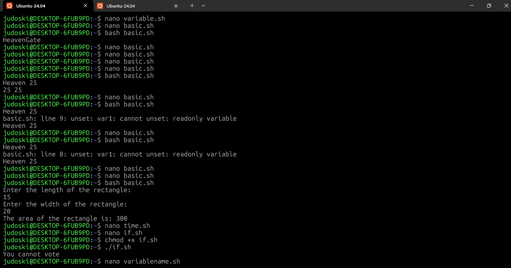
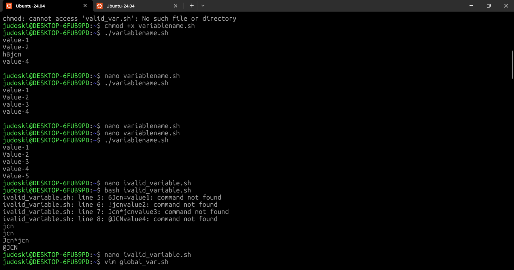
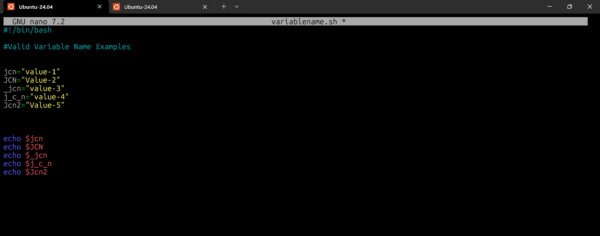
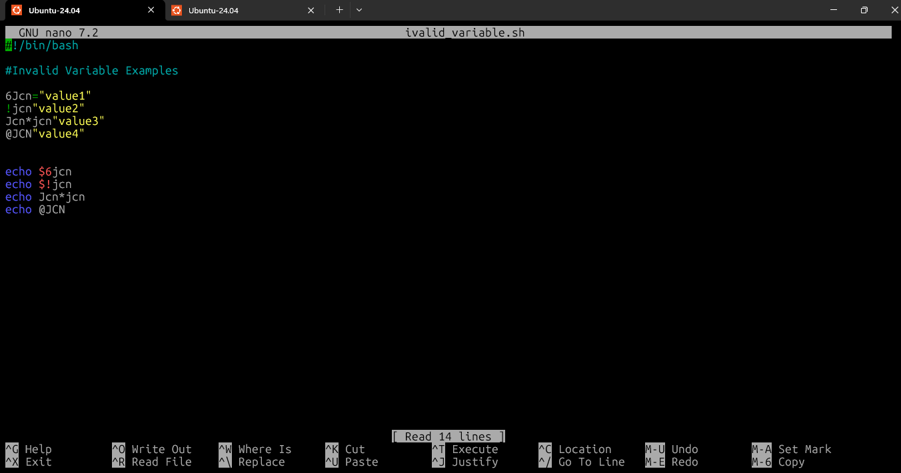
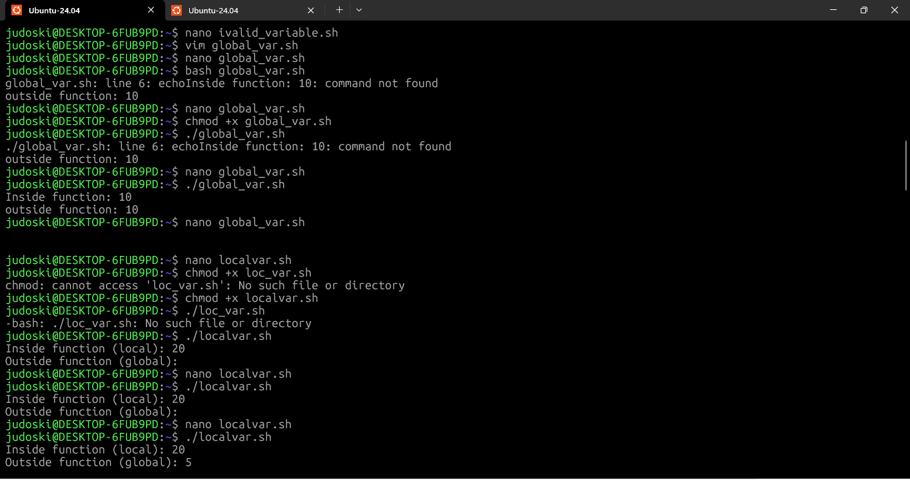
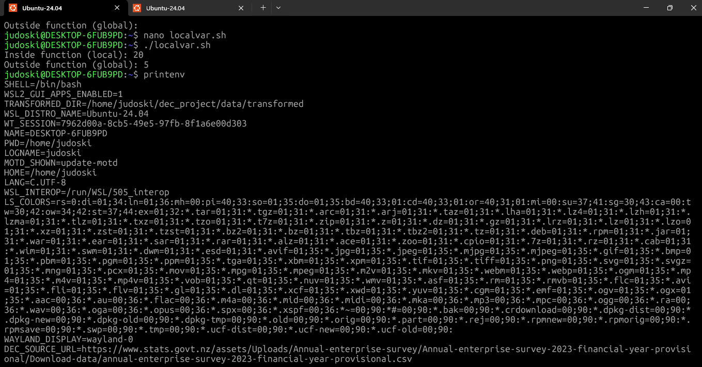
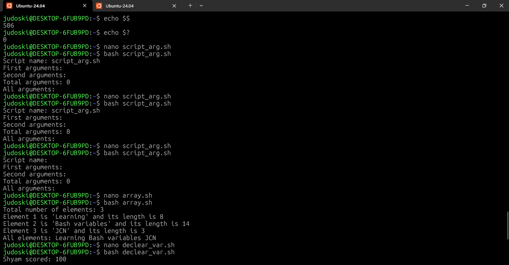
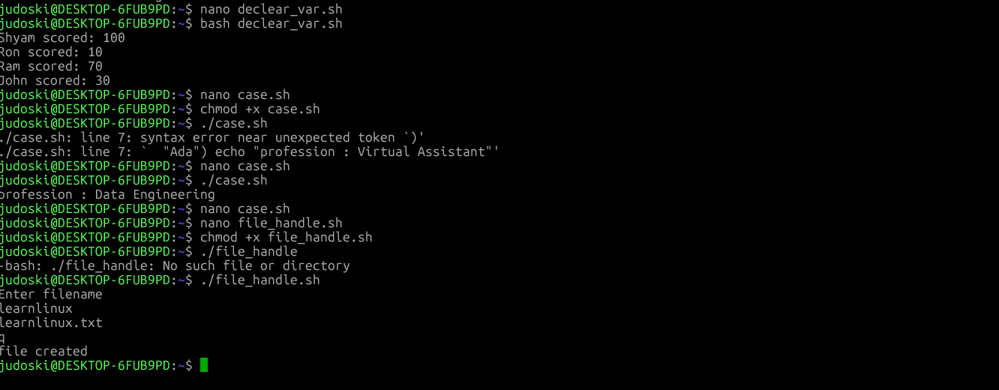

# **Day 24 – Variables in Shell Scripting**

### *30 Days of Linux Learning with Data Engineering Community*

---

## **Objective**

Today was about introducing **state into shell scripts**.

Up to this point, scripts were executing commands.
Now, they can **store, transform, and react to data** during execution.

The goal was simple:

Understand how variables enable **dynamic, data-driven scripting** instead of static command execution.

---

## **What Changed Today**

Before today, scripts were:

* Fixed
* Predictable
* Repetitive

After introducing variables, scripts become:

* Dynamic
* Input-driven
* Context-aware

This is the exact transition from **command execution → program logic**.

---

## **Core Concept: What is a Variable?**

A variable is a **runtime storage container** that holds data while a script is executing.

That data can be:

* User input
* System state
* Command output
* Static values

At execution time, the shell **replaces the variable name with its value**.

---

## **Execution Model (Important)**

Shell processes variables like this:

1. Read script line by line
2. Identify variables
3. Substitute values
4. Execute commands

👉 This means variables are not “stored objects”
They are **evaluated at runtime during execution**

---

## **Variable Types (System-Level View)**

### **1. Local Variables (Script Scope)**

* Exist only inside the script/session
* Destroyed after execution
* Not inherited by child processes

```bash
name="JCN"
echo $name
```

👉 Used for **temporary logic and computation**

---

### **2. Environment Variables (System Scope)**

* Persist across processes
* Inherited by child shells/programs
* Define system behavior

```bash
echo $PATH
echo $HOME
echo $USER
```

👉 These control:

* Where executables are found
* User environment
* System configuration

---

### **3. Special (Built-in) Variables**

Provide **execution metadata**

```bash
echo $?   # Exit status
echo $$   # Process ID
echo $0   # Script name
echo $1   # First argument
```

👉 Critical for:

* Debugging
* Error handling
* Script parameterization

---

## **Syntax Rules (Non-Negotiable)**

### **Assignment**

```bash
name="JCN"
```

Invalid:

```bash
name = "JCN"   ❌
```

👉 Shell treats spaces as command separators

---

### **Access**

```bash
echo $name
```

---

### **Safe Usage (Best Practice)**

```bash
echo "$name"
```

👉 Prevents:

* Word splitting
* Unexpected parsing errors

---

## **Data Flow in Scripts**

### **1. Capturing User Input**

```bash
read username
echo "Hello $username"
```

👉 Script becomes interactive

---

### **2. Capturing Command Output**

```bash
time=$(date +%H:%M)
echo $time
```

👉 Script becomes **system-aware**

---

## **Control Flow with Variables**

Variables enable **decision-making**

```bash
age=17

if [ "$age" -ge 18 ]; then
    echo "Allowed"
else
    echo "Denied"
fi
```

👉 This is where scripting becomes logic-driven

---

## **Variable Lifecycle Management**

### **Readonly (Immutable State)**

```bash
readonly PI=3.14
```

---

### **Unset (Destroy Variable)**

```bash
unset name
```

---

### **Export (Process Sharing)**

```bash
export VAR="production"
```

👉 Makes variable available to child processes

---

## **What I Practiced**

* Built scripts using dynamic variables
* Captured user input using `read`
* Stored system output using `$(command)`
* Implemented conditional logic with variables
* Tested variable scope and lifecycle
* Practiced safe variable handling with quotes

---

## **Challenges Faced**

### **1. Assignment Errors**

Used spaces around `=`

👉 Fix:
Strict syntax enforcement

---

### **2. Broken Output with Spaces**

Variables split unexpectedly

👉 Fix:
Always wrap variables in quotes

---

### **3. Scope Misunderstanding**

Expected variables to persist outside scripts

👉 Fix:
Understand **local vs environment scope**

---

## **Key Takeaways**

* Variables introduce **state into scripts**
* Scripts become **data-driven, not command-driven**
* `$` is for access, not assignment
* Quotes are not optional — they are critical
* Environment variables define system behavior
* Special variables enable debugging and control

Most importantly:

**Variables are what turn shell scripts into real programs**

---

## **System Insight**

This directly maps to real-world engineering:

* Data pipelines rely on dynamic parameters
* Automation scripts depend on runtime inputs
* Deployment scripts use environment variables
* Monitoring systems depend on exit codes

Without variables → no flexibility
Without flexibility → no automation

---

## **Output**

At the end of today:

* I can design dynamic shell scripts
* I understand how data flows inside execution
* I can control script behavior using variables
* I can debug using special variables

---











