# **Day 25 – Variables & Basic Scripting Practice (Hands-On)**

**30 Days of Linux Learning with Data Engineering Community**

---

## **Objective**

Today was not about learning new commands.

It was about **executing, debugging, and organizing real scripts** using:

* variables
* input/output
* conditions
* file handling

This is where scripting becomes **practical**.

---

## **Environment Setup (Project Structure)**

Before writing more scripts, I structured my workspace:

```bash
mkdir -p ~/linux-practice/scripts
mkdir -p ~/linux-practice/notes
```

👉 What this does:

* `mkdir -p` creates directories (and parent folders if they don’t exist)
* Helps organize scripts like a real project

Then I moved all my scripts into one place:

```bash
mv my_first_scripts.sh userinput.sh posargu.sh userdata.sh myscript.sh var.sh if.sh ifcon.sh runscript.sh file.sh employee.sh compare.sh ~/linux-practice/scripts/
```

👉 Insight:

* This is basic **project organization**
* Separating scripts from your home directory avoids clutter

---

## **Working with Vim (Editing Scripts)**

```bash
vim myscript.sh
```

### Key Commands:

```
:w     → save
:q     → quit
:wq    → save and quit
:q!    → exit without saving
```

👉 Real issue I faced:

* I mistakenly added `:` in my shebang → script failed
* Shows how sensitive Bash syntax is

---

## **Making Scripts Executable (VERY IMPORTANT)**

After writing a script, Linux does NOT allow execution by default.

### Step 1: Add Execute Permission

```bash
chmod +x employee.sh
```

👉 What this means:

* `chmod` = change file permissions
* `+x` = add execute permission

Without this → you will get:

```
Permission denied
```

---

### Step 2: Run the Script

```bash
./employee.sh
```

👉 Why `./` ?

* It tells Linux:

  > “Run this file from the current directory”

Without `./`, Linux will search only in system PATH directories.

---

### Alternative Way (No chmod needed)

```bash
bash employee.sh
```

👉 This directly passes the script to Bash interpreter

---

## **Your Actual Terminal Experience (Real Output)**

### ❌ Error 1: Wrong File Name

```bash
./shelltest.sh
-bash: ./shelltest.sh: No such file or directory
```

👉 Cause:

* Typo in filename

---

### ❌ Error 2: Permission Denied

```bash
./shelltext.sh
-bash: ./shelltext.sh: Permission denied
```

👉 Fix:

```bash
chmod +x shelltext.sh
```

---

### ✅ Correct Execution

```bash
./shelltext.sh
Good Morning Jcn! a good way to start your day is hot coffetea can i order one for you?
```

---

## **Script 1 – Variables Practice**

```bash
#!/bin/bash

NAME="Judoski"
ROLE="Data Engineer"
YEAR=2026

echo "Hello, my name is $NAME"
echo "I am a $ROLE"
echo "The Year is $YEAR"
```

### Output:

```bash
Hello, my name is Judoski
I am a Data Engineer
The Year is 2026
```

👉 What’s happening:

* Variables store values
* `$NAME` retrieves value
* Script becomes reusable

---

## **Script 2 – User Input (Interactive Script)**

```bash
#!/bin/bash

echo What is your first Name?
read FIRST_NAME

echo what is your last Name
read LAST_NAME

echo What is job title
read JOB_TITLE

echo Hello $FIRST_NAME $LAST_NAME $JOB_TITLE
```

### Output:

```bash
What is your first Name?
JCN
what is your last Name
COTURE
What is job title
Fashion Designer
Hello JCN COTURE Fashion Designer
```

👉 Insight:

* `read` makes scripts interactive
* This is how CLI tools collect user data

---

## **Script 3 – Command Substitution**

```bash
now=$(date)
echo $now
```

### Output:

```bash
Wed May 6 18:36:45 WAT 2026
```

👉 Meaning:

* `$(command)` stores command output into a variable

---

## **Script 4 – File Checker (Real Logic)**

```bash
read -p "Enter a filename to check: " filename

if [ -f ~/"$filename" ]; then
    echo "The file '$filename' exists."
    ls -lh ~/"$filename"
else
    echo "The file '$filename' does not exist."

    read -p "would you like to create it? (y/n): " choice

    if [[ "$choice" == "y" ]]; then
        touch ~/"$filename"
        echo "file '$filename' has been created"
    else
        echo "No file created."
    fi
fi
```

### Output:

```bash
Enter a filename to check: salary
The file 'salary' exists.
-rw-r--r-- 1 judoski judoski 0 May 6 13:20 /home/judoski/salary
```

---

## **Script 5 – Number Comparison (With Validation)**

```bash
read -p "Enter first number: " num1
read -p "Enter second number: " num2

if [[ ! $num1 =~ ^[-+]?[0-9]+$ ]] || [[ ! $num2 =~ ^[-+]?[0-9]+$ ]]; then
    echo "Error: Both inputs must be integers."
    exit 1
fi

if (( num1 > num2 )); then
    echo "$num1 is larger"
elif (( num2 > num1 )); then
    echo "$num2 is larger"
else
    echo "Both are equal"
fi
```

### Output:

```bash
Enter first number: 20
Enter second number: 45
Result: 45 is larger than 20.
```

👉 This is **real scripting logic**:

* Input validation
* Arithmetic comparison
* Error handling

---

## **Other Commands Practiced**

### Redirection

```bash
echo Good Morning! > greet.txt
echo How are you >> greet.txt
```

### Output:

```bash
cat greet.txt
Good Morning!
How are you
```

---

### Word Count

```bash
wc -w greet.txt
13 greet.txt
```

---

### Here String / Here Doc

```bash
wc -w <<< "Hello Give me the word count!"
```

Output:

```
6
```

---

## **Major Challenge (Syntax Error)**

```bash
if [[ "$choice" == "yes" || "$choice" == "Yes"]]; then
```

### Error:

```
syntax error near unexpected token `;'
```

👉 Problem:

* Missing space before `]]`

### Fix:

```bash
if [[ "$choice" == "yes" || "$choice" == "Yes" ]]; then
```

---

## **Key Takeaways**

* `chmod +x` is required to execute scripts
* `./script.sh` runs script from current directory
* Always check filenames carefully
* Bash is strict with syntax (spaces matter)
* Scripts become powerful when combined with:

  * input
  * logic
  * file handling

---

## **Final Reflection**

Today was pure execution.

Not:

* watching
* reading

But:

* writing scripts
* breaking them
* fixing them

That shift matters.

Because in real engineering:

> You don’t get it right the first time
> You debug until it works

And today that actually happened.

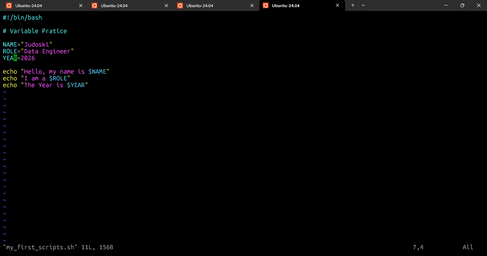
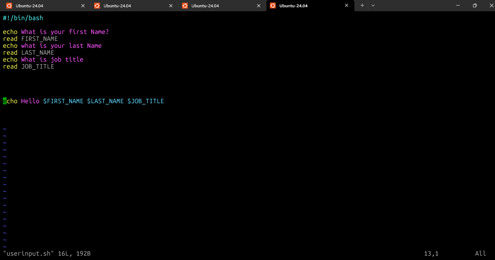
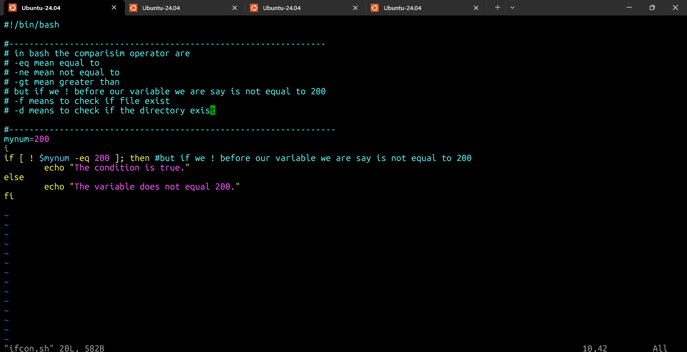
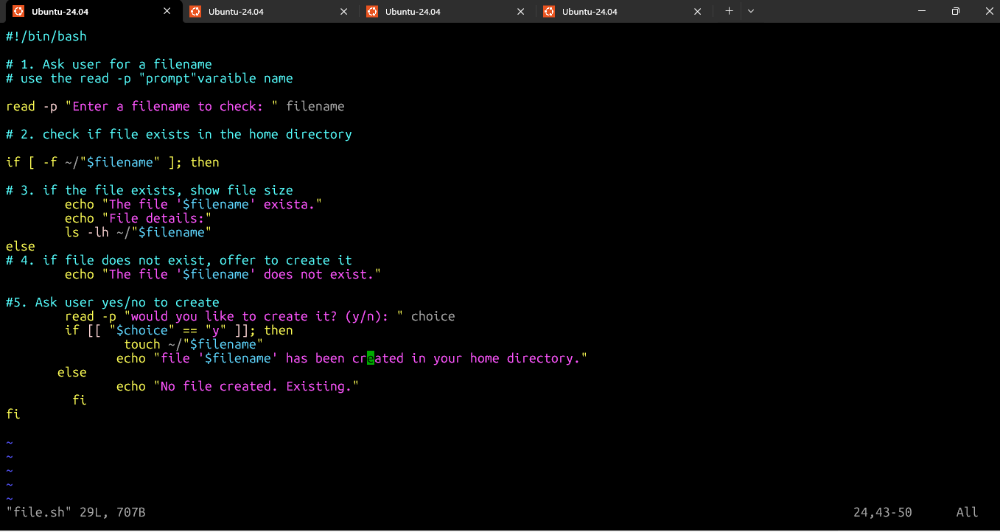
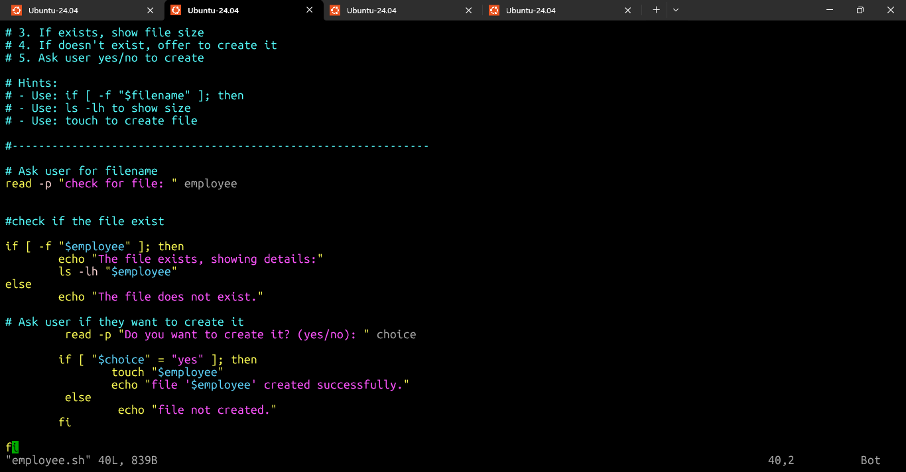
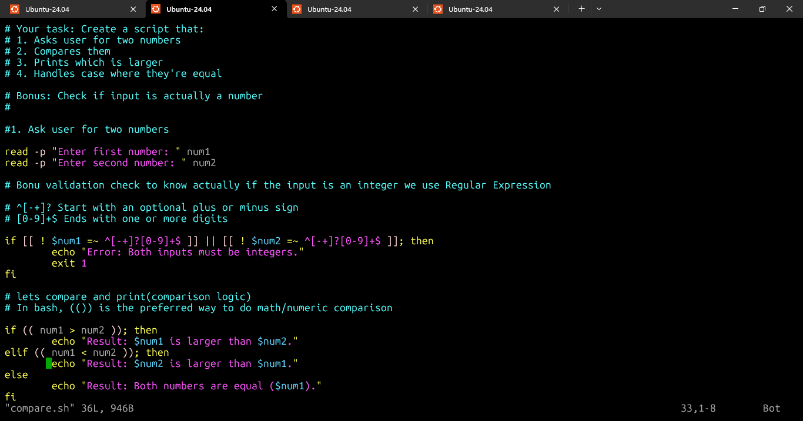
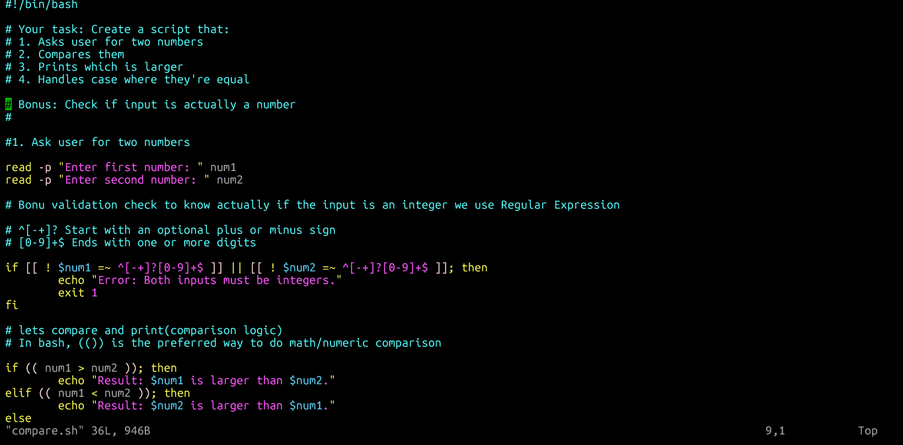
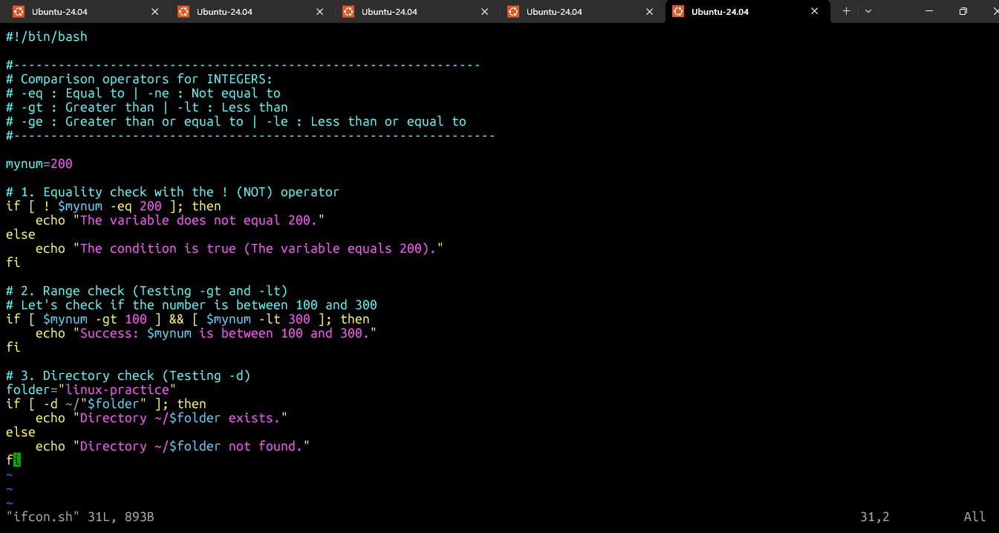
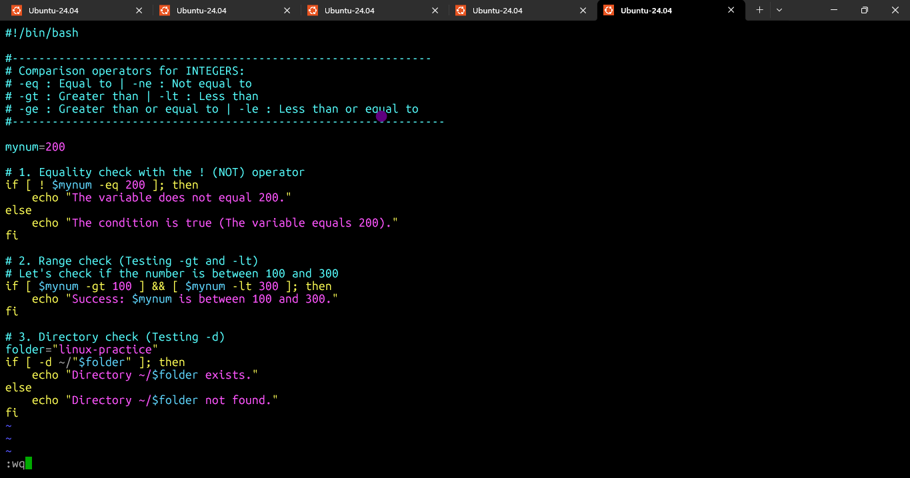
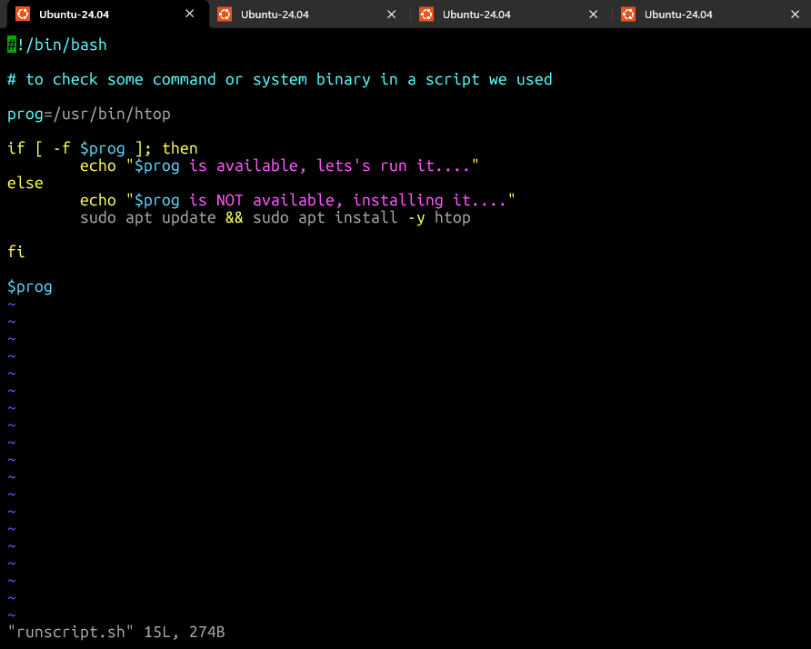
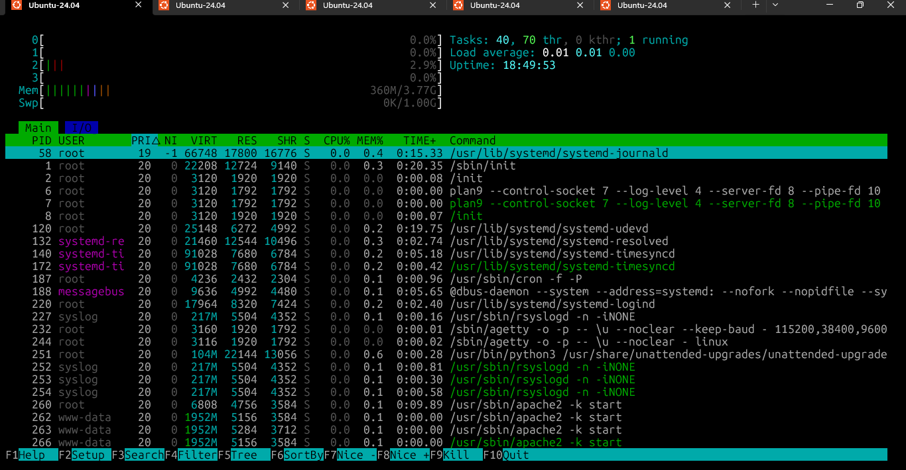
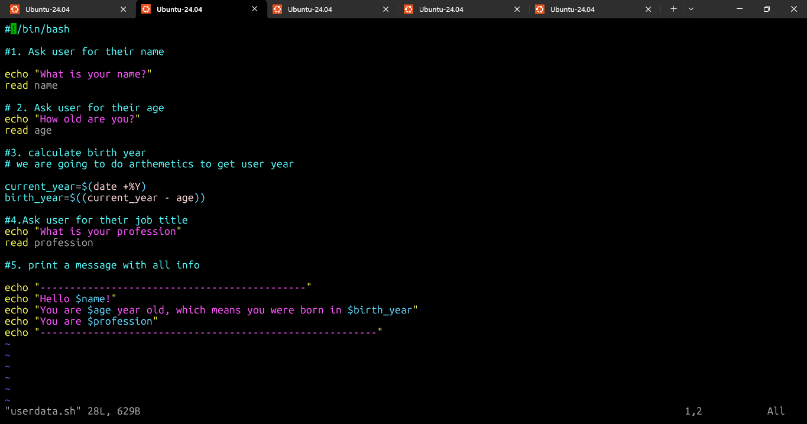
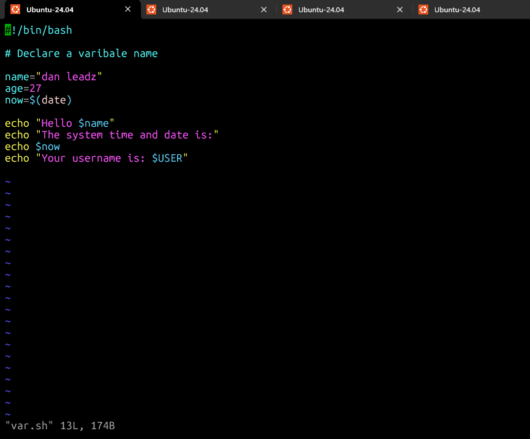
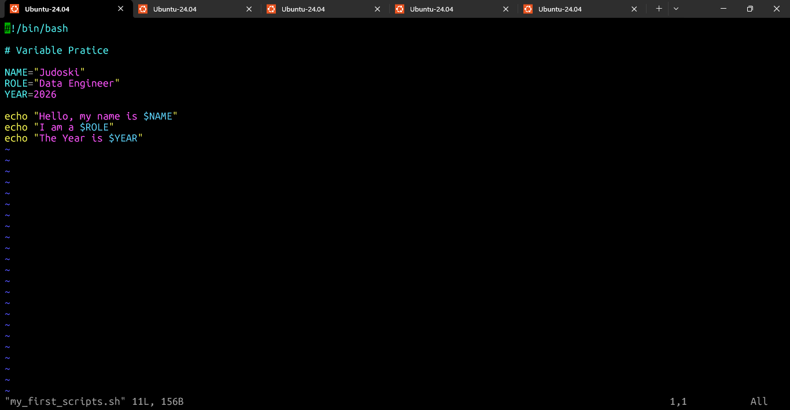
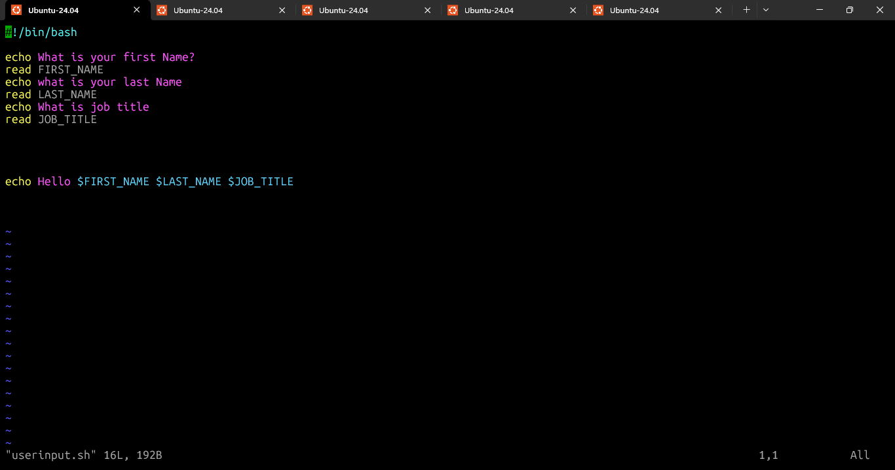
