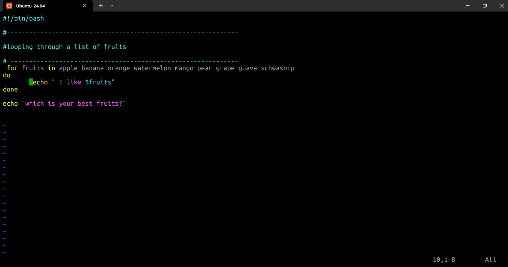
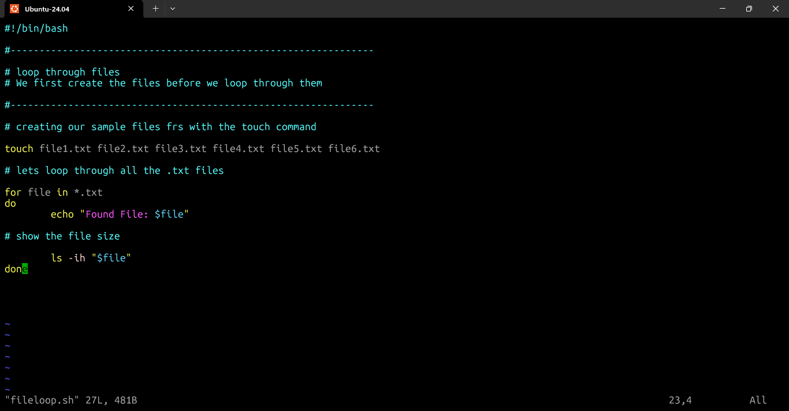
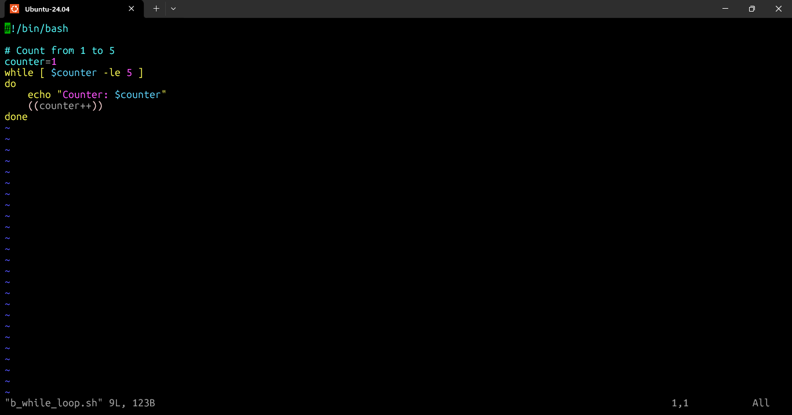
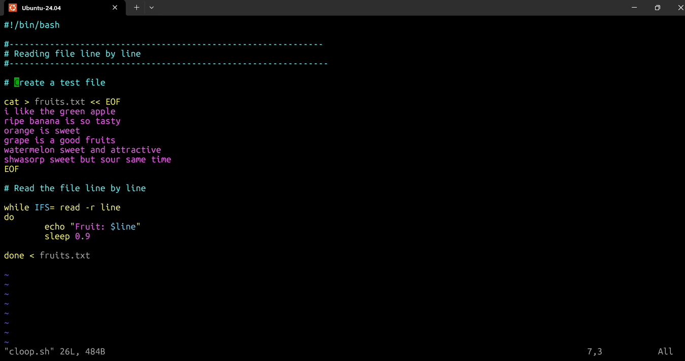
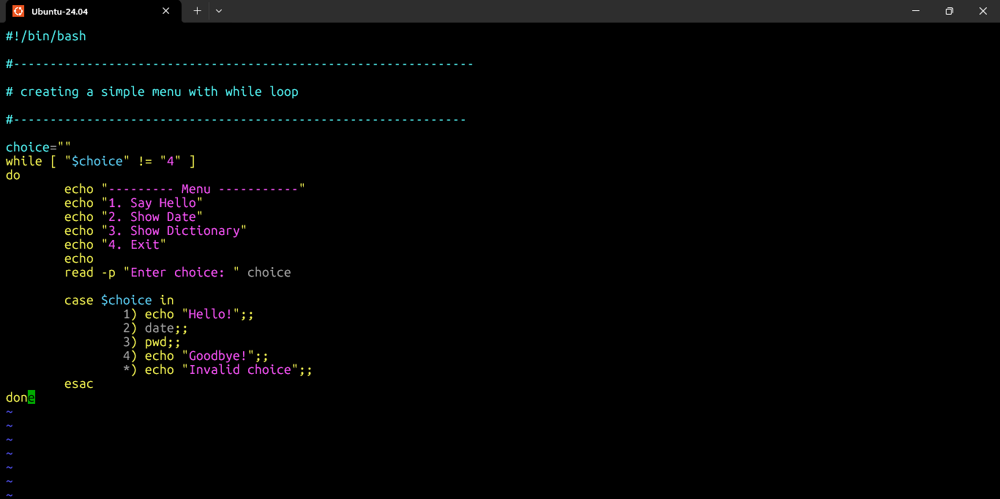
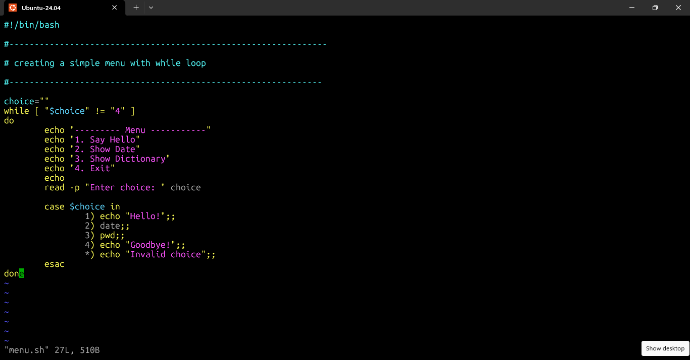
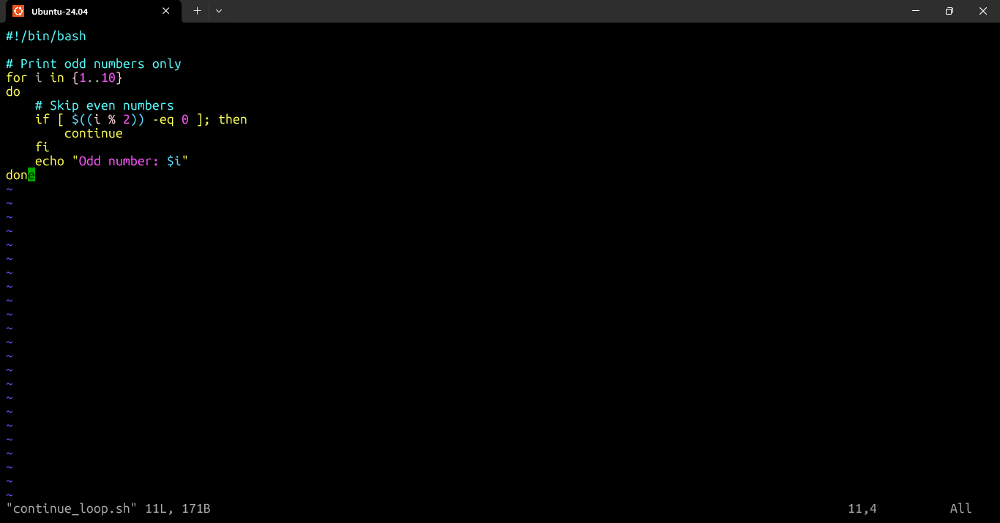
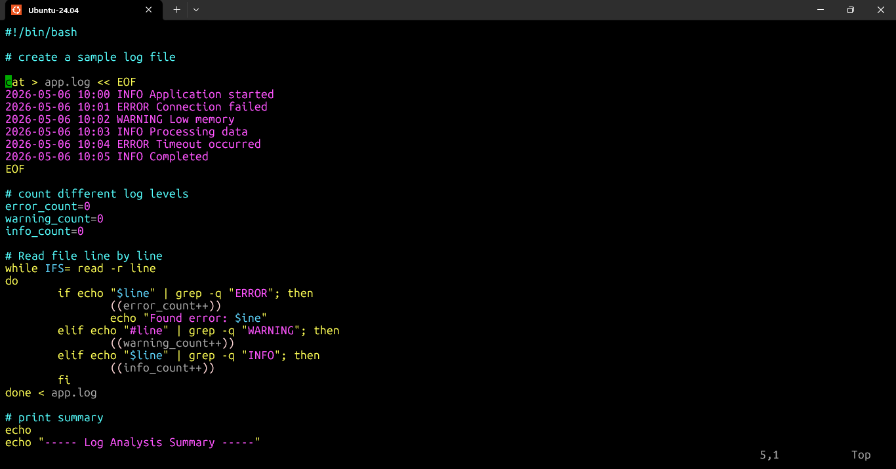

# Day 26 – Loops in Bash Scripting (Practice & Exercises)

### 30 Days of Linux Learning with Data Engineering Community

## Objective

Today was focused on understanding how loops work in Bash scripting and how they help automate repetitive tasks.

Instead of writing the same command multiple times, loops allow Bash to repeat instructions automatically.

This is one of the foundations of:

* automation
* system administration
* DevOps workflows
* data engineering scripting

---

# What I Practiced

Today’s practice covered:

* `for` loops
* `while` loops
* looping through files
* reading files line by line
* menu-driven scripts
* `break` and `continue`
* backup automation
* log file analysis

---

# Exercise 1 – Basic For Loop

## Creating the Script

```bash
judoski@DESKTOP-6FUB9PD:~$ vim loop.sh
```

## Script

```bash
#!/bin/bash

# Practice example for loop

for n in {1..10}
do
        echo $n
        sleep 1
done

echo "outside the for loop."
```

## Making Script Executable

```bash
judoski@DESKTOP-6FUB9PD:~$ chmod +x loop.sh
```

## Running the Script

```bash
judoski@DESKTOP-6FUB9PD:~$ ./loop.sh
```

## Output

```bash
1
2
3
4
5
6
7
8
9
10
outside the for loop.
```

## What I Learned

* `{1..10}` generates numbers from 1 to 10
* `sleep 1` delays execution for 1 second
* `chmod +x` makes the script executable
* `./script.sh` runs the script from the current directory

---

# Exercise 2 – Loop Through a List

## Creating the Script

```bash
judoski@DESKTOP-6FUB9PD:~$ vim listloop.sh
```

## Script

```bash
#!/bin/bash

# Looping through a list of fruits

for fruits in apple banana orange watermelon mango pear grape guava schwasorp
do
        echo " I like $fruits"
done

echo "which is your best fruits?"
```

## Running the Script

```bash
judoski@DESKTOP-6FUB9PD:~$ ./listloop.sh
```

## Output

```bash
 I like apple
 I like banana
 I like orange
 I like watermelon
 I like mango
 I like pear
 I like grape
 I like guava
 I like schwasorp
which is your best fruits?
```

## What I Learned

A `for` loop can iterate through:

* lists
* variables
* command outputs
* filenames

---

# Exercise 3 – Loop Through Files

## Script

```bash
#!/bin/bash

# Loop through files

# Creating sample files

touch file1.txt file2.txt file3.txt file4.txt file5.txt file6.txt

# Loop through all .txt files

for file in *.txt
do
        echo "Found File: $file"

        ls -ih "$file"
done
```

## Running the Script

```bash
judoski@DESKTOP-6FUB9PD:~$ bash fileloop.sh
```

## Output

```bash
Found File: employee.txt
2104 employee.txt

Found File: file1.txt
11582 file1.txt

Found File: file2.txt
45700 file2.txt

Found File: file3.txt
46408 file3.txt

Found File: file4.txt
46409 file4.txt
```

## What I Learned

* `*.txt` selects all text files
* loops help automate file operations
* useful for backups and monitoring

---

# Exercise 4 – Basic While Loop

## Script

```bash
#!/bin/bash

counter=1

while [ $counter -le 5 ]
do
    echo "Counter: $counter"
    ((counter++))
done
```

## Running the Script

```bash
judoski@DESKTOP-6FUB9PD:~$ bash b_while_loop.sh
```

## Output

```bash
Counter: 1
Counter: 2
Counter: 3
Counter: 4
Counter: 5
```

## What I Learned

* `while` loops continue while a condition remains true
* `((counter++))` increments the variable
* useful for condition-based execution

---

# Exercise 5 – Read File Line by Line

## Script

```bash
#!/bin/bash

# Create a test file

cat > fruits.txt << EOF
i like the green apple
ripe banana is so tasty
orange is sweet
grape is a good fruits
watermelon sweet and attractive
shwasorp sweet but sour same time
EOF

# Read file line by line

while IFS= read -r line
do
        echo "Fruit: $line"
        sleep 0.9

done < fruits.txt
```

## Running the Script

```bash
judoski@DESKTOP-6FUB9PD:~$ bash cloop.sh
```

## Output

```bash
Fruit: i like the green apple
Fruit: ripe banana is so tasty
Fruit: orange is sweet
Fruit: grape is a good fruits
Fruit: watermelon sweet and attractive
Fruit: shwasorp sweet but sour same time
```

## What I Learned

This method is useful for:

* reading logs
* processing datasets
* parsing files
* automation workflows

---

# Exercise 6 – Menu System

## Script

```bash
#!/bin/bash

choice=""

while [ "$choice" != "4" ]
do
        echo "--------- Menu -----------"
        echo "1. Say Hello"
        echo "2. Show Date"
        echo "3. Show Dictionary"
        echo "4. Exit"
        echo

        read -p "Enter choice: " choice

        case $choice in
                1) echo "Hello!";;
                2) date;;
                3) pwd;;
                4) echo "Goodbye!";;
                *) echo "Invalid choice";;
        esac
done
```

## Running the Script

```bash
judoski@DESKTOP-6FUB9PD:~$ bash menu.sh
```

## Output

```bash
--------- Menu -----------
1. Say Hello
2. Show Date
3. Show Dictionary
4. Exit

Enter choice: 1
Hello!

--------- Menu -----------
1. Say Hello
2. Show Date
3. Show Dictionary
4. Exit

Enter choice: 2
Thu May  7 16:54:38 WAT 2026

--------- Menu -----------
1. Say Hello
2. Show Date
3. Show Dictionary
4. Exit

Enter choice: 3
/home/judoski
```

## What I Learned

This introduced:

* interactive Bash scripting
* user input handling
* menu-driven automation

---

# Exercise 7 – Break Statement

## Script

```bash
#!/bin/bash

# Find first even number greater than 15

for i in {1..30}
do
        if [ $i -gt 15 ] && [ $((i % 2)) -eq 0 ]; then
                echo "Found: $i"
                break
        fi
done
```

## What I Learned

`break` immediately stops loop execution once a condition is satisfied.

---

# Exercise 8 – Continue Statement

## Running the Script

```bash
judoski@DESKTOP-6FUB9PD:~$ bash continue_loop.sh
```

## Output

```bash
Odd number: 1
Odd number: 3
Odd number: 5
Odd number: 7
Odd number: 9
```

## What I Learned

`continue` skips the current iteration and moves to the next loop cycle.

---

# Real-World Practice – Backup Automation

## Script

```bash
#!/bin/bash

# Create backup folder with date

backup_dir="backup_$(date +%Y%m%d)"
mkdir -p "$backup_dir"

count=0

for file in *.txt
do
    if [ ! -e "$file" ]; then
        echo "No .txt files found"
        break
    fi

    cp "$file" "$backup_dir/"
    echo "Backed up: $file"

    ((count++))
done

echo
echo "Total files backed up: $count"
echo "Backup location: $backup_dir"
```

## Checking Backup Folder

```bash
judoski@DESKTOP-6FUB9PD:~$ ls -l backup_*
```

## Output

```bash
backup_20260508:
total 0
```

## What I Learned

This simulated:

* backup automation
* file management
* real-world system administration tasks

---

# Exercise 9 – Log File Analyzer

## Running the Script

```bash
judoski@DESKTOP-6FUB9PD:~$ bash log_file_analyzer.sh
```

## Output

```bash
Found error:
Found error:

----- Log Analysis Summary -----

Errors: 2
Warnings: 0
Info: 3
Total: 5
```

## What I Learned

This introduced:

* log monitoring
* text processing
* automation for system diagnostics

---

# Key Commands Practiced

```bash
vim
chmod +x
./script.sh
bash script.sh
for
while
break
continue
case
read
touch
cp
mkdir -p
sleep
grep
ls
pwd
date
```

---

# Key Takeaways

Today shifted my understanding of Bash scripting.

I moved from:

* running commands manually

to:

* automating repeated operations

Loops make Bash scripting scalable and efficient.

This is important in:

* DevOps
* Linux administration
* Data Engineering
* Cloud operations

Because real systems rely heavily on automation.

---















