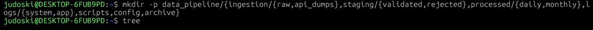
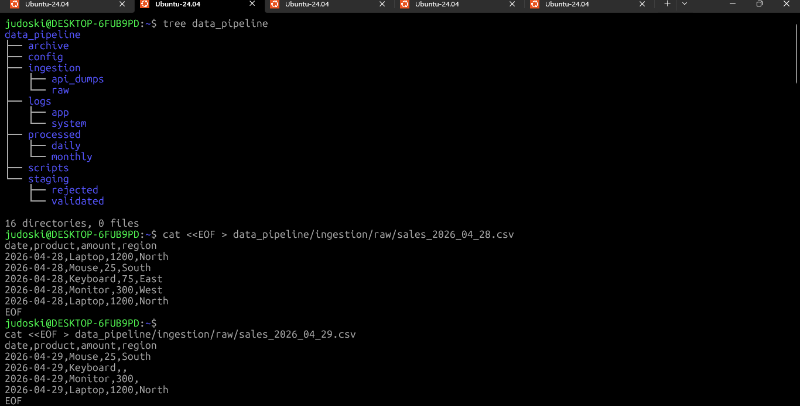
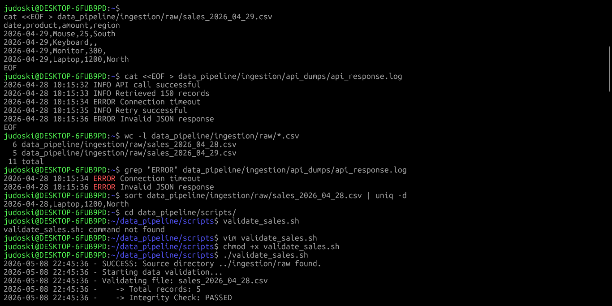

# DataOps Pipeline Automation System (Part 1)

## Day 27/30 – Linux Learning Journey with Data Engineering Community

### Project: Real-World Data Engineering Simulation

This capstone project simulates how a real Data Engineer handles data ingestion, validation, monitoring, and automation in a production-like Linux environment.

The goal was to build a mini DataOps pipeline capable of:

* Ingesting raw data from multiple sources
* Detecting duplicates and missing values
* Monitoring API/system logs
* Automating validation checks
* Organizing raw and processed data properly

---

# Project Structure

The project follows a real-world Data Engineering folder architecture:

```bash
data_pipeline/
├── ingestion/
│   ├── raw/
│   └── api_dumps/
├── staging/
│   ├── validated/
│   └── rejected/
├── processed/
│   ├── daily/
│   └── monthly/
├── logs/
│   ├── system/
│   └── app/
├── scripts/
├── config/
└── archive/
```

---

# Phase 1 – Environment Setup

## Creating the Directory Structure

```bash
mkdir -p data_pipeline/{ingestion/{raw,api_dumps},staging/{validated,rejected},processed/{daily,monthly},logs/{system,app},scripts,config,archive}
```

### Why this matters

In Data Engineering:

* Raw data should never mix with processed data
* Logs should be isolated from scripts
* Staging layers help validate data before processing
* Organized pipelines improve automation and maintainability

The `-p` flag allows nested folders to be created safely without errors if folders already exist.

---

# Verifying the Structure

## Command

```bash
judoski@DESKTOP-6FUB9PD:~$ tree data_pipeline
```

## Output

```bash
data_pipeline
├── archive
├── config
├── ingestion
│   ├── api_dumps
│   └── raw
├── logs
│   ├── app
│   └── system
├── processed
│   ├── daily
│   └── monthly
├── scripts
└── staging
    ├── rejected
    └── validated

16 directories, 0 files
```

---

# Phase 2 – Data Ingestion Simulation

The goal here was to simulate receiving messy production data from APIs and CSV files.

---

# Creating Sample Sales CSV Files

## sales_2026_04_28.csv

```bash
judoski@DESKTOP-6FUB9PD:~$ cat <<EOF > data_pipeline/ingestion/raw/sales_2026_04_28.csv
date,product,amount,region
2026-04-28,Laptop,1200,North
2026-04-28,Mouse,25,South
2026-04-28,Keyboard,75,East
2026-04-28,Monitor,300,West
2026-04-28,Laptop,1200,North
EOF
```

This dataset intentionally contains duplicate records.

---

## sales_2026_04_29.csv

```bash
judoski@DESKTOP-6FUB9PD:~$ cat <<EOF > data_pipeline/ingestion/raw/sales_2026_04_29.csv
date,product,amount,region
2026-04-29,Mouse,25,South
2026-04-29,Keyboard,,
2026-04-29,Monitor,300,
2026-04-29,Laptop,1200,North
EOF
```

This dataset intentionally contains missing values.

---

# Simulating API Log Dumps

## Command

```bash
judoski@DESKTOP-6FUB9PD:~$ cat <<EOF > data_pipeline/ingestion/api_dumps/api_response.log
2026-04-28 10:15:32 INFO API call successful
2026-04-28 10:15:33 INFO Retrieved 150 records
2026-04-28 10:15:34 ERROR Connection timeout
2026-04-28 10:15:35 INFO Retry successful
2026-04-28 10:15:36 ERROR Invalid JSON response
EOF
```

This simulates real production API logs with failures and retries.

---

# Data Validation & Monitoring

## Counting Total Records

### Command

```bash
judoski@DESKTOP-6FUB9PD:~$ wc -l data_pipeline/ingestion/raw/*.csv
```

### Output

```bash
  6 data_pipeline/ingestion/raw/sales_2026_04_28.csv
  5 data_pipeline/ingestion/raw/sales_2026_04_29.csv
 11 total
```

### Why it matters

`wc -l` acts as a sanity check during ingestion.

If a source system claims to send 1000 records but Linux counts only 500 rows, the pipeline has already failed before transformation even begins.

---

# Monitoring API Errors

## Command

```bash
judoski@DESKTOP-6FUB9PD:~$ grep "ERROR" data_pipeline/ingestion/api_dumps/api_response.log
```

## Output

```bash
2026-04-28 10:15:34 ERROR Connection timeout
2026-04-28 10:15:36 ERROR Invalid JSON response
```

### Why it matters

This is basic DataOps monitoring.

Using `grep` helps engineers quickly detect:

* failed API calls
* connection issues
* malformed responses
* ingestion failures

---

# Detecting Duplicate Records

## Command

```bash
judoski@DESKTOP-6FUB9PD:~$ sort data_pipeline/ingestion/raw/sales_2026_04_28.csv | uniq -d
```

## Output

```bash
2026-04-28,Laptop,1200,North
```

### Why it matters

Duplicate records can corrupt analytics dashboards and inflate business metrics.

Detecting duplicates early prevents inaccurate reporting downstream.

---

# Phase 3 – Building the Validation Automation Script

Initially, the script failed because it was not executable.

## Attempt

```bash
judoski@DESKTOP-6FUB9PD:~/data_pipeline/scripts$ validate_sales.sh
```

## Output

```bash
validate_sales.sh: command not found
```

---

# Creating the Script

## Using Vim

```bash
judoski@DESKTOP-6FUB9PD:~/data_pipeline/scripts$ vim validate_sales.sh
```

---

# Making the Script Executable

## Command

```bash
judoski@DESKTOP-6FUB9PD:~/data_pipeline/scripts$ chmod +x validate_sales.sh
```

### Why chmod +x matters

Linux scripts are not executable by default.

The command:

```bash
chmod +x validate_sales.sh
```

adds execute permission to the script.

Without it, Linux treats the file as a normal text file instead of a runnable program.

---

# Running the Script

## Command

```bash
judoski@DESKTOP-6FUB9PD:~/data_pipeline/scripts$ ./validate_sales.sh
```

### Why `./` is used

`./` tells Linux to execute the script from the current directory.

Without `./`, Bash searches only system PATH locations for executable programs.

---

# Script Output

```bash
2026-05-08 22:45:36 - SUCCESS: Source directory ../ingestion/raw found.
2026-05-08 22:45:36 - Starting data validation...
2026-05-08 22:45:36 - Validating file: sales_2026_04_28.csv
2026-05-08 22:45:36 -    -> Total records: 5
2026-05-08 22:45:36 -    -> Integrity Check: PASSED
2026-05-08 22:45:36 - Validating file: sales_2026_04_29.csv
2026-05-08 22:45:36 -    -> Total records: 4
2026-05-08 22:45:36 -    -> WARNING: Missing data detected in sales_2026_04_29.csv!
2026-05-08 22:45:36 - Validation process complete.
```

---

# Validation Script

```bash
#!/bin/bash

RAW_DIR="../ingestion/raw"
LOG_FILE="../logs/system/validation_$(date +%Y%m%d).log"

log_message() {
    echo "$(date '+%Y-%m-%d %H:%M:%S') - $1" >> "$LOG_FILE"
}

if [ -d "$RAW_DIR" ]; then
    log_message "SUCCESS: Source directory found."
else
    log_message "ERROR: Source directory $RAW_DIR not found."
    exit 1
fi

for file in "$RAW_DIR"/*.csv; do
    if [ -f "$file" ]; then
        row_count=$(tail -n +2 "$file" | wc -l)

        log_message "INFO: Processing $(basename "$file") - $row_count records."

        if grep -qE ',,|^,|,$' "$file"; then
            log_message "WARNING: $(basename "$file") has missing fields."
        else
            log_message "PASSED: $(basename "$file") validation."
        fi
    fi
done
```

---

# Key Linux Commands Practiced

| Command        | Purpose                   |
| -------------- | ------------------------- |
| mkdir -p       | Create nested directories |
| tree           | Display folder hierarchy  |
| cat <<EOF      | Create multi-line files   |
| wc -l          | Count records             |
| grep           | Search logs               |
| sort | uniq -d | Detect duplicates         |
| vim            | Edit scripts              |
| chmod +x       | Make scripts executable   |
| ./script.sh    | Execute scripts           |
| tail           | Skip CSV headers          |

---

# Key Lessons Learned

* Linux is heavily used in real Data Engineering environments
* Folder structure matters in pipeline design
* Data validation should be automated
* Logs are critical for monitoring system health
* Shell scripting helps reduce manual pipeline operations
* Small Linux utilities can perform powerful data operations efficiently

---

# Project Focus

### DataOps Pipeline Automation System (Part 1)

Focus Areas:

* Infrastructure setup
* Data ingestion
* Quality validation
* Log monitoring
* Bash automation

---

# Next Phase

Upcoming stages will focus on:

* Data transformation
* Automated processing
* Scheduling workflows
* Archiving
* Monitoring pipeline health
* End-to-end automation

---






