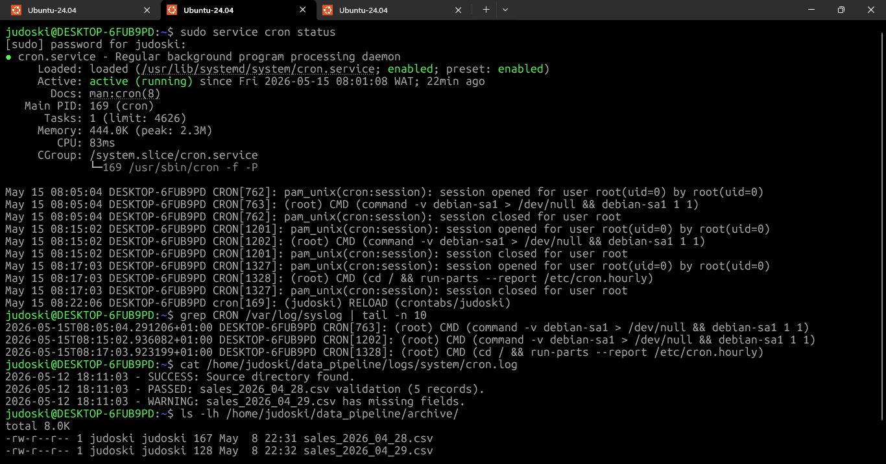
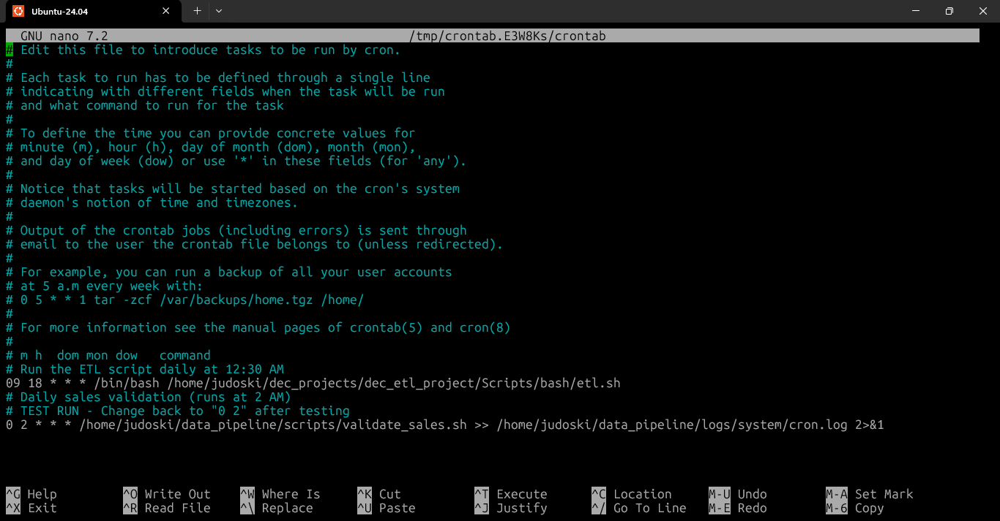
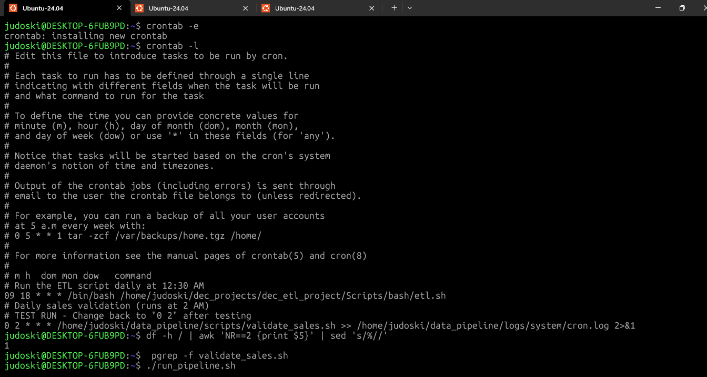
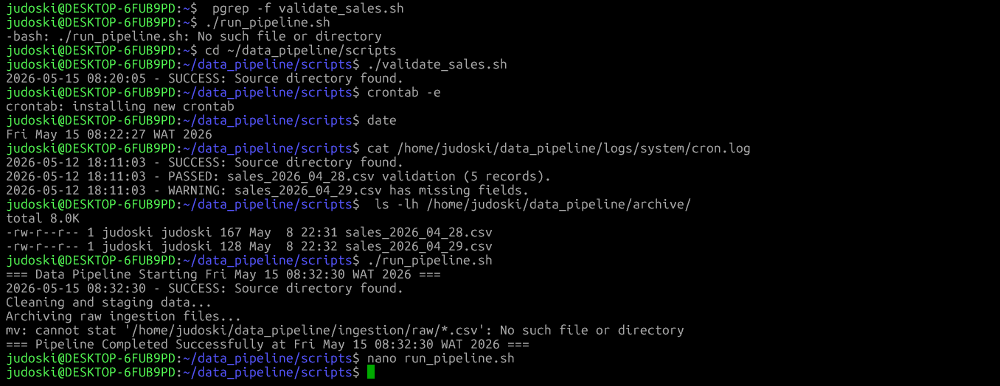

# Day 28/30 Days of Linux Learning With DEC

# DataOps Pipeline: Linux Automation System (Part 2)

## Project Focus

### Orchestration • Monitoring • Automation • Resilience • Production Readiness

Day 28 focused on turning the Linux Data Pipeline into a more production-ready DataOps workflow.

In real-world Data Engineering, pipelines are not manually executed every day.
They are:

* automated,
* monitored,
* validated,
* logged,
* and designed to recover safely from failures.

This phase introduced:

* Cron scheduling,
* system monitoring,
* observability,
* error handling,
* orchestration,
* and resilience engineering.

---
## Project Architecture

data_pipeline/
├── ingestion/
│   ├── raw/
│   └── api_dumps/
├── staging/
│   ├── validated/
│   └── rejected/
├── processed/
│   ├── daily/
│   └── monthly/
├── logs/
│   ├── system/
│   └── app/
├── scripts/
├── config/
└── archive/
---

# Phase 5 — Automation & Scheduling

## Why Automation Matters

In Data Engineering, manual execution is unreliable.

Production pipelines are scheduled to run automatically during:

* low traffic periods,
* overnight batch windows,
* or fixed operational intervals.

This ensures:

* consistent execution,
* reduced human error,
* predictable workflows.

---

# Editing the Crontab

## Command Used

```bash id="h4qj3d"
judoski@DESKTOP-6FUB9PD:~$ crontab -e
```

---

# Installing the Cron Job

```bash id="q9ml9j"
crontab: installing new crontab
```

---

# Cron Schedule Entry

```bash id="s2f97f"
0 2 * * * /home/judoski/data_pipeline/scripts/run_pipeline.sh >> /home/judoski/data_pipeline/logs/system/cron.log 2>&1
```

---

# Understanding the Cron Syntax

| Syntax | Meaning       |
| ------ | ------------- |
| `0`    | Minute        |
| `2`    | Hour (2 AM)   |
| `*`    | Every day     |
| `*`    | Every month   |
| `*`    | Every weekday |

---

# What This Means

```text id="gztc8k"
Run the Data Pipeline automatically every day at exactly 2:00 AM
```

---

# Why 2:00 AM Matters in Data Engineering

This is called a:

## Nightly Batch Window

Most production ETL pipelines run overnight because:

* fewer users are active,
* databases experience lower traffic,
* heavy jobs consume fewer resources,
* reporting dashboards are refreshed before business hours.

---

# Standard Output & Error Logging

## Command Logic

```bash id="n6uk8u"
>> cron.log 2>&1
```

---

# Explanation

| Syntax        | Purpose                            |
| ------------- | ---------------------------------- |
| `>> cron.log` | Append standard output to log file |
| `2>&1`        | Redirect errors into same log      |

---

# Why This Matters

Cron jobs are:

## headless processes

They do not display output on the screen.

Without log redirection:

* failures become invisible,
* debugging becomes difficult,
* pipelines may silently fail.

This introduces:

## observability

Observability allows engineers to:

* inspect logs,
* diagnose failures,
* monitor pipeline behavior.

---

# Verifying Cron Jobs

## Command Used

```bash id="h7yxmk"
judoski@DESKTOP-6FUB9PD:~$ crontab -l
```

---

# Cron Verification Output

```text id="k2fr0p"
# Run the ETL script daily at 12:30 AM
09 18 * * * /bin/bash /home/judoski/dec_projects/dec_etl_project/Scripts/bash/etl.sh

# Daily sales validation (runs at 2 AM)
0 2 * * * /home/judoski/data_pipeline/scripts/validate_sales.sh >> /home/judoski/data_pipeline/logs/system/cron.log 2>&1
```

---

# Phase 6 — System Monitoring Integration

# Why Monitoring Matters

A Data Pipeline is only as reliable as the machine running it.

Before executing heavy ETL jobs, engineers perform:

## pre-flight system checks

This prevents:

* disk exhaustion,
* failed writes,
* corrupted ingestion,
* incomplete processing.

---

# Disk Usage Monitoring

## Command Used

```bash id="wlcz7g"
judoski@DESKTOP-6FUB9PD:~$ df -h / | awk 'NR==2 {print $5}' | sed 's/%//'
1
```

---

# Breaking Down the Command

## Step 1 — `df -h /`

Checks disk usage in human-readable format.

Example:

```text id="m4k0j2"
Filesystem      Size  Used Avail Use%
/dev/sdb        250G   90G  150G  36%
```

---

## Step 2 — `awk 'NR==2 {print $5}'`

Extracts:

* second row,
* fifth column (`36%`).

---

## Step 3 — `sed 's/%//'`

Removes `%` sign.

Result becomes:

```text id="2sk1vl"
36
```

This allows Bash to compare it numerically.

---

# Why Disk Monitoring Matters

If storage reaches:

```text id="gk4w5s"
99%
```

and a pipeline tries ingesting large datasets:

* the ETL job may crash,
* writes may become incomplete,
* files may corrupt,
* databases may become inconsistent.

This monitoring step protects the pipeline before execution begins.

---

# Process Monitoring

## Command Used

```bash id="fy8xly"
judoski@DESKTOP-6FUB9PD:~$ pgrep -f validate_sales.sh
```

---

# Output

```text id="bskg7x"
```

No output means:

```text id="j3ew57"
No existing validate_sales.sh process is currently running
```

---

# Why Process Monitoring Matters

This prevents:

## Race Conditions

A race condition happens when:

* multiple scripts try modifying the same files simultaneously.

This can lead to:

* corrupted data,
* overwritten outputs,
* incomplete transformations.

Production pipelines must always prevent duplicate execution.

---

# Phase 7 — Error Handling & Resilience

# Why Failure Handling Matters

In production systems:

## Success is expected.

## Failure handling is what proves reliability.

A Data Engineer must ensure:

* failures are detected,
* errors are logged,
* pipelines stop safely.

---

# Exit Codes

| Exit Code | Meaning              |
| --------- | -------------------- |
| `exit 0`  | Successful execution |
| `exit 1`  | Failure occurred     |

---

# Why Exit Codes Matter

In enterprise systems:

* failed jobs trigger alerts,
* orchestration tools stop downstream tasks,
* monitoring systems notify engineers.

Without proper exit codes:

* broken pipelines may appear successful,
* invalid data may continue downstream,
* reports may become inaccurate.

---

# Alert Logging

## Alert File

```text id="8pnm1x"
logs/system/alerts.log
```

---

# Why Alert Logs Matter

This creates a centralized location for:

* critical failures,
* pipeline incidents,
* operational troubleshooting.

In cloud systems like:

* AWS,
* Azure,
* GCP,

these failures could trigger:

* Slack alerts,
* email notifications,
* retry workflows.

---

# Phase 8 — Final Integration & Orchestration

# The Master Orchestrator

This phase combined all previous phases into one centralized workflow.

The orchestration script controls:

1. System checks
2. Data validation
3. Data cleaning
4. Data staging
5. File archiving

This behaves similarly to:

* Apache Airflow DAGs,
* ETL orchestrators,
* enterprise workflow engines.

---

# Master Script — `run_pipeline.sh`

## Script Logic

```bash id="y3e6gc"
#!/bin/bash

# Script: run_pipeline.sh
# Purpose: Master Orchestrator for DataOps Pipeline

PIPELINE_HOME="/home/judoski/data_pipeline"
SCRIPTS_DIR="$PIPELINE_HOME/scripts"
RAW_DIR="$PIPELINE_HOME/ingestion/raw"
STAGING_DIR="$PIPELINE_HOME/staging/validated"
ARCHIVE_DIR="$PIPELINE_HOME/archive"

echo "=== Data Pipeline Starting $(date) ==="

# Step 1: System check
bash "$SCRIPTS_DIR/check_system.sh"

if [ $? -ne 0 ]; then
    echo "$(date) - CRITICAL: System check failed. Aborting pipeline."
    exit 1
fi

# Step 2: Data validation
bash "$SCRIPTS_DIR/validate_sales.sh"

if [ $? -ne 0 ]; then
    echo "$(date) - ERROR: Validation phase failed."
    exit 1
fi

# Step 3: Data cleaning
echo "Cleaning and staging data..."

for file in "$RAW_DIR"/*.csv; do
    if [ -f "$file" ]; then

        filename=$(basename "$file")

        awk -F',' '$3 != ""' "$file" > "$STAGING_DIR/$filename"

        echo "Successfully cleaned and staged: $filename"
    fi
done

# Step 4: Archive files
echo "Archiving raw ingestion files..."

mv "$RAW_DIR"/*.csv "$ARCHIVE_DIR/"

echo "=== Pipeline Completed Successfully at $(date) ==="

exit 0
```

---

# Pipeline Execution

## Running the Pipeline

```bash id="mopfdw"
judoski@DESKTOP-6FUB9PD:~/data_pipeline/scripts$ ./run_pipeline.sh
```

---

# Pipeline Output

```text id="gmj2t9"
=== Data Pipeline Starting Fri May 15 08:32:30 WAT 2026 ===

2026-05-15 08:32:30 - SUCCESS: Source directory found.

Cleaning and staging data...

Archiving raw ingestion files...

mv: cannot stat '/home/judoski/data_pipeline/ingestion/raw/*.csv': No such file or directory

=== Pipeline Completed Successfully at Fri May 15 08:32:30 WAT 2026 ===
```

---

# Understanding the Error

## Error Encountered

```bash id="gm41ng"
mv: cannot stat '/home/judoski/data_pipeline/ingestion/raw/*.csv': No such file or directory
```

---

# Why This Happened

The pipeline had already:

* processed,
* cleaned,
* and archived

the CSV files earlier.

So the `raw/` directory became empty.

When `mv` attempted moving files again:

```text id="ybd1h4"
No matching CSV files existed
```

---

# Data Engineering Significance

This is actually a realistic production scenario.

Pipelines must gracefully handle:

* empty ingestion folders,
* delayed data arrival,
* missing files,
* retry conditions.

---

# Production Improvement

A safer production implementation would be:

```bash id="d7t4d1"
if ls "$RAW_DIR"/*.csv 1> /dev/null 2>&1; then
    mv "$RAW_DIR"/*.csv "$ARCHIVE_DIR/"
else
    echo "No CSV files available for archiving."
fi
```

This prevents:

* unnecessary failures,
* noisy logs,
* misleading pipeline messages.

---

# Checking Pipeline Logs

## Command Used

```bash id="prrq1d"
judoski@DESKTOP-6FUB9PD:~/data_pipeline/scripts$ cat /home/judoski/data_pipeline/logs/system/cron.log
```

---

# Log Output

```text id="w3fw3f"
2026-05-12 18:11:03 - SUCCESS: Source directory found.
2026-05-12 18:11:03 - PASSED: sales_2026_04_28.csv validation (5 records).
2026-05-12 18:11:03 - WARNING: sales_2026_04_29.csv has missing fields.
```

---

# Checking Archived Files

## Command Used

```bash id="nmbi0r"
judoski@DESKTOP-6FUB9PD:~/data_pipeline/scripts$ ls -lh /home/judoski/data_pipeline/archive/
```

---

# Archive Output

```text id="mhk44h"
total 8.0K
-rw-r--r-- 1 judoski judoski 167 May  8 22:31 sales_2026_04_28.csv
-rw-r--r-- 1 judoski judoski 128 May  8 22:32 sales_2026_04_29.csv
```

---

# Data Engineering Concepts Practiced

## 1. Pipeline Scheduling

Using cron jobs for automated execution.

---

## 2. Observability

Using:

* logs,
* monitoring,
* output tracking,
* error tracing.

---

## 3. System Health Monitoring

Checking:

* disk usage,
* active processes,
* execution readiness.

---

## 4. Error Handling

Using:

* exit codes,
* alert logs,
* controlled failures.

---

## 5. ETL Orchestration

Creating dependent execution stages.

---

## 6. Data Cleaning

Using `awk` to filter invalid records.

---

## 7. Data Lifecycle Management

Archiving raw ingestion files after processing.

---

# Commands Practiced Today

```bash id="e2qqow"
crontab -e
crontab -l
df -h
awk
sed
pgrep
chmod +x
./run_pipeline.sh
cat cron.log
ls -lh
mv
exit 0
exit 1
```

---

# Key Lessons Learned

* Automation reduces manual workload.
* Logging improves observability.
* Monitoring prevents failed ETL runs.
* Exit codes control workflow behavior.
* Pipelines must handle failures gracefully.
* Empty ingestion states must be anticipated.
* Linux shell scripting can orchestrate full ETL workflows.

---









